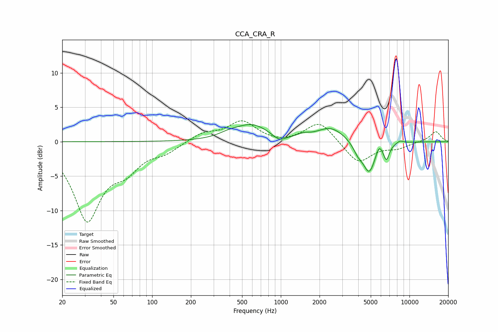

# CCA_CRA_R
See [usage instructions](https://github.com/jaakkopasanen/AutoEq#usage) for more options and info.

### Parametric EQs
Apply preamp of -2.6 dB when using parametric equalizer.

|   # | Type    |   Fc (Hz) |    Q |   Gain (dB) |
|-----|---------|-----------|------|-------------|
|   1 | Peaking |       394 | 1.75 |         0.5 |
|   2 | Peaking |       596 | 1.09 |         2.3 |
|   3 | Peaking |       971 | 2.86 |        -0.9 |
|   4 | Peaking |      1503 | 3.33 |         0.4 |
|   5 | Peaking |      2447 | 1.3  |         2   |
|   6 | Peaking |      3985 | 3.62 |        -1.3 |
|   7 | Peaking |      4863 | 2.93 |        -4.4 |
|   8 | Peaking |      5801 | 6    |         1.2 |
|   9 | Peaking |      6625 | 6    |        -2.2 |
|  10 | Peaking |      8439 | 5.06 |         0.4 |

### Fixed Band EQs
When using fixed band (also called graphic) equalizer, apply preamp of **-3.1 dB** (if available) and set gains manually with these parameters.

|   # | Type    |   Fc (Hz) |    Q |   Gain (dB) |
|-----|---------|-----------|------|-------------|
|   1 | Peaking |        31 | 1.41 |       -11.1 |
|   2 | Peaking |        62 | 1.41 |        -3   |
|   3 | Peaking |       125 | 1.41 |        -1.3 |
|   4 | Peaking |       250 | 1.41 |         1.2 |
|   5 | Peaking |       500 | 1.41 |         2.9 |
|   6 | Peaking |      1000 | 1.41 |        -0.4 |
|   7 | Peaking |      2000 | 1.41 |         3   |
|   8 | Peaking |      4000 | 1.41 |        -3.2 |
|   9 | Peaking |      8000 | 1.41 |        -0.8 |
|  10 | Peaking |     16000 | 1.41 |         1.5 |

### Graphs

