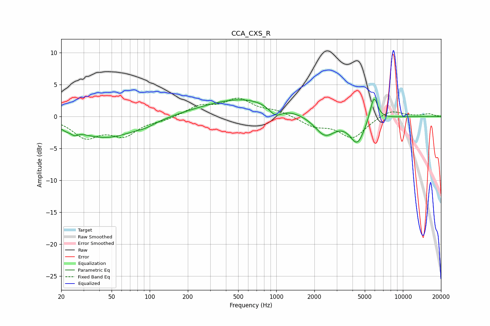

# CCA_CXS_R
See [usage instructions](https://github.com/jaakkopasanen/AutoEq#usage) for more options and info.

### Parametric EQs
Apply preamp of -2.8 dB when using parametric equalizer.

|   # | Type    |   Fc (Hz) |    Q |   Gain (dB) |
|-----|---------|-----------|------|-------------|
|   1 | Peaking |        22 | 3.39 |        -0.5 |
|   2 | Peaking |        25 | 5.75 |        -0.6 |
|   3 | Peaking |        45 | 0.59 |        -3.3 |
|   4 | Peaking |        92 | 2.08 |        -0.4 |
|   5 | Peaking |       210 | 0.78 |         0.2 |
|   6 | Peaking |       556 | 0.48 |         2.8 |
|   7 | Peaking |       984 | 2.79 |        -1.6 |
|   8 | Peaking |      2420 | 1.73 |        -3.1 |
|   9 | Peaking |      4365 | 2.4  |        -4   |
|  10 | Peaking |      5900 | 4.54 |         3.9 |

### Fixed Band EQs
When using fixed band (also called graphic) equalizer, apply preamp of **-3.0 dB** (if available) and set gains manually with these parameters.

|   # | Type    |   Fc (Hz) |    Q |   Gain (dB) |
|-----|---------|-----------|------|-------------|
|   1 | Peaking |        31 | 1.41 |        -3.1 |
|   2 | Peaking |        62 | 1.41 |        -2.7 |
|   3 | Peaking |       125 | 1.41 |        -0.5 |
|   4 | Peaking |       250 | 1.41 |         1.5 |
|   5 | Peaking |       500 | 1.41 |         2.6 |
|   6 | Peaking |      1000 | 1.41 |         0.8 |
|   7 | Peaking |      2000 | 1.41 |        -1.4 |
|   8 | Peaking |      4000 | 1.41 |        -3.3 |
|   9 | Peaking |      8000 | 1.41 |         1.1 |
|  10 | Peaking |     16000 | 1.41 |         0.4 |

### Graphs

