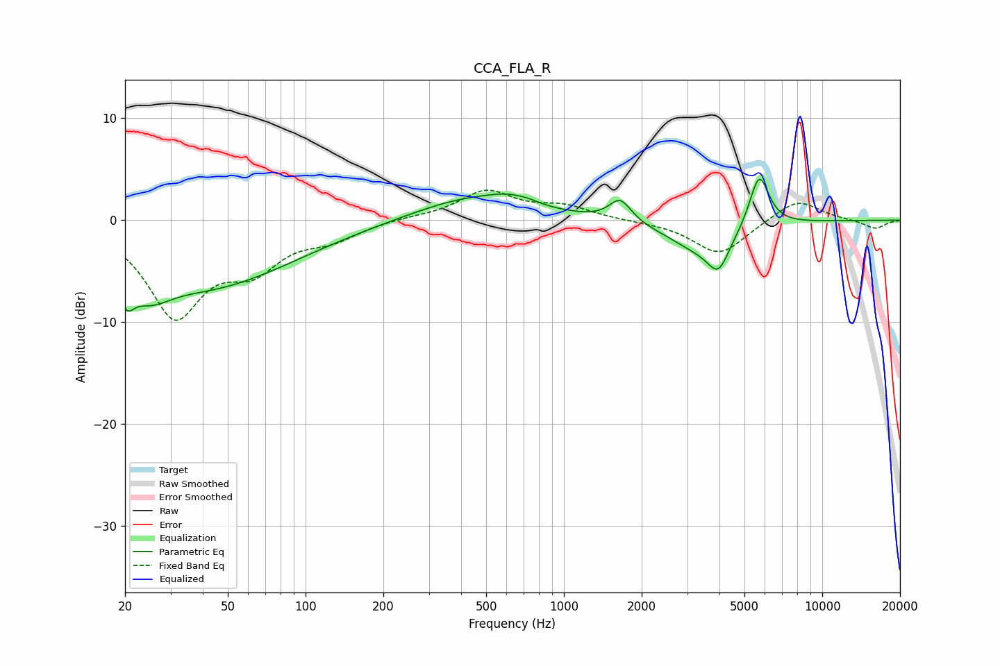

# CCA_FLA_R
See [usage instructions](https://github.com/jaakkopasanen/AutoEq#usage) for more options and info.

### Parametric EQs
Apply preamp of -4.1 dB when using parametric equalizer.

|   # | Type    |   Fc (Hz) |    Q |   Gain (dB) |
|-----|---------|-----------|------|-------------|
|   1 | Peaking |        20 | 5    |        -2.5 |
|   2 | Peaking |        25 | 1.71 |        -2.6 |
|   3 | Peaking |        41 | 0.41 |        -6.4 |
|   4 | Peaking |       442 | 0.63 |         2.3 |
|   5 | Peaking |       622 | 1.77 |         0.8 |
|   6 | Peaking |       734 | 4.56 |         0.1 |
|   7 | Peaking |      1653 | 3.35 |         2.2 |
|   8 | Peaking |      3363 | 1.11 |        -2.8 |
|   9 | Peaking |      3967 | 3.37 |        -3   |
|  10 | Peaking |      5699 | 3.62 |         5.3 |

### Fixed Band EQs
When using fixed band (also called graphic) equalizer, apply preamp of **-3.0 dB** (if available) and set gains manually with these parameters.

|   # | Type    |   Fc (Hz) |    Q |   Gain (dB) |
|-----|---------|-----------|------|-------------|
|   1 | Peaking |        31 | 1.41 |        -9   |
|   2 | Peaking |        62 | 1.41 |        -3.9 |
|   3 | Peaking |       125 | 1.41 |        -1.5 |
|   4 | Peaking |       250 | 1.41 |         0.2 |
|   5 | Peaking |       500 | 1.41 |         2.8 |
|   6 | Peaking |      1000 | 1.41 |         1.2 |
|   7 | Peaking |      2000 | 1.41 |        -0.1 |
|   8 | Peaking |      4000 | 1.41 |        -3.4 |
|   9 | Peaking |      8000 | 1.41 |         2.2 |
|  10 | Peaking |     16000 | 1.41 |        -0.9 |

### Graphs

