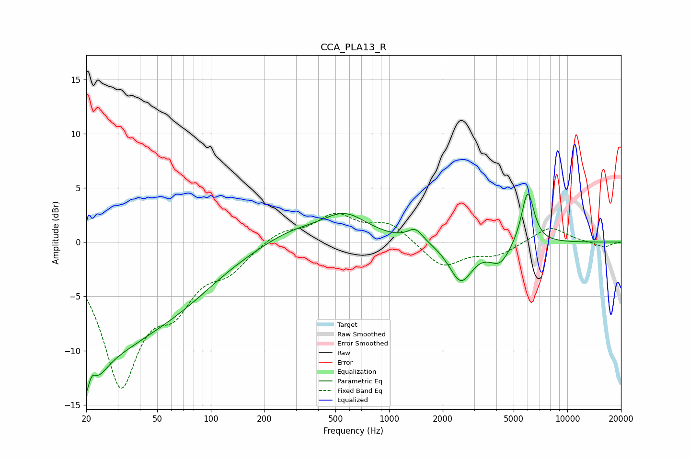

# CCA_PLA13_R
See [usage instructions](https://github.com/jaakkopasanen/AutoEq#usage) for more options and info.

### Parametric EQs
Apply preamp of -4.5 dB when using parametric equalizer.

|   # | Type    |   Fc (Hz) |    Q |   Gain (dB) |
|-----|---------|-----------|------|-------------|
|   1 | Peaking |        20 | 2.13 |       -10.6 |
|   2 | Peaking |        21 | 4.83 |         3.9 |
|   3 | Peaking |        30 | 0.54 |        -7   |
|   4 | Peaking |        70 | 0.6  |        -2.7 |
|   5 | Peaking |       284 | 0.83 |         1.1 |
|   6 | Peaking |       565 | 1.1  |         2.4 |
|   7 | Peaking |      1406 | 3.24 |         1.2 |
|   8 | Peaking |      2524 | 2.19 |        -3.6 |
|   9 | Peaking |      4187 | 2.34 |        -1.9 |
|  10 | Peaking |      5995 | 3.9  |         5   |

### Fixed Band EQs
When using fixed band (also called graphic) equalizer, apply preamp of **-2.8 dB** (if available) and set gains manually with these parameters.

|   # | Type    |   Fc (Hz) |    Q |   Gain (dB) |
|-----|---------|-----------|------|-------------|
|   1 | Peaking |        31 | 1.41 |       -12.6 |
|   2 | Peaking |        62 | 1.41 |        -4.3 |
|   3 | Peaking |       125 | 1.41 |        -2.1 |
|   4 | Peaking |       250 | 1.41 |         1.1 |
|   5 | Peaking |       500 | 1.41 |         2.4 |
|   6 | Peaking |      1000 | 1.41 |         1.7 |
|   7 | Peaking |      2000 | 1.41 |        -2.3 |
|   8 | Peaking |      4000 | 1.41 |        -1.1 |
|   9 | Peaking |      8000 | 1.41 |         1.5 |
|  10 | Peaking |     16000 | 1.41 |        -0.5 |

### Graphs

