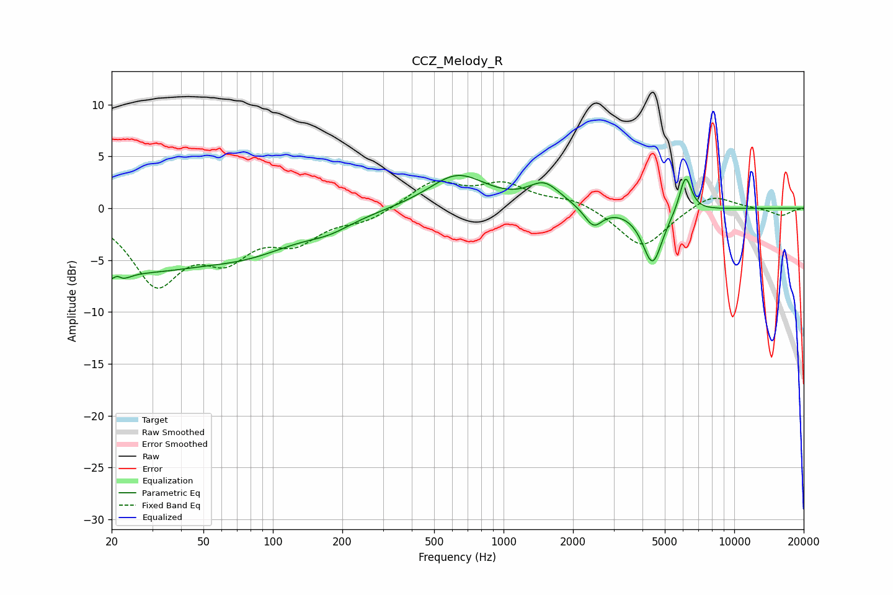

# CCZ_Melody_R
See [usage instructions](https://github.com/jaakkopasanen/AutoEq#usage) for more options and info.

### Parametric EQs
Apply preamp of -3.3 dB when using parametric equalizer.

|   # | Type    |   Fc (Hz) |    Q |   Gain (dB) |
|-----|---------|-----------|------|-------------|
|   1 | Peaking |        21 | 4.27 |        -4.3 |
|   2 | Peaking |        21 | 5.91 |         3.2 |
|   3 | Peaking |        25 | 0.46 |        -5.2 |
|   4 | Peaking |        81 | 0.63 |        -2.8 |
|   5 | Peaking |       175 | 1.36 |        -1   |
|   6 | Peaking |       631 | 1.13 |         3.2 |
|   7 | Peaking |      1503 | 2.03 |         2.1 |
|   8 | Peaking |      2452 | 3.6  |        -1.9 |
|   9 | Peaking |      4423 | 3.22 |        -5.3 |
|  10 | Peaking |      6144 | 5.28 |         3.6 |

### Fixed Band EQs
When using fixed band (also called graphic) equalizer, apply preamp of **-2.7 dB** (if available) and set gains manually with these parameters.

|   # | Type    |   Fc (Hz) |    Q |   Gain (dB) |
|-----|---------|-----------|------|-------------|
|   1 | Peaking |        31 | 1.41 |        -6.9 |
|   2 | Peaking |        62 | 1.41 |        -3.9 |
|   3 | Peaking |       125 | 1.41 |        -2.8 |
|   4 | Peaking |       250 | 1.41 |        -1.1 |
|   5 | Peaking |       500 | 1.41 |         2.5 |
|   6 | Peaking |      1000 | 1.41 |         2.1 |
|   7 | Peaking |      2000 | 1.41 |         0.9 |
|   8 | Peaking |      4000 | 1.41 |        -3.9 |
|   9 | Peaking |      8000 | 1.41 |         1.5 |
|  10 | Peaking |     16000 | 1.41 |        -0.7 |

### Graphs

