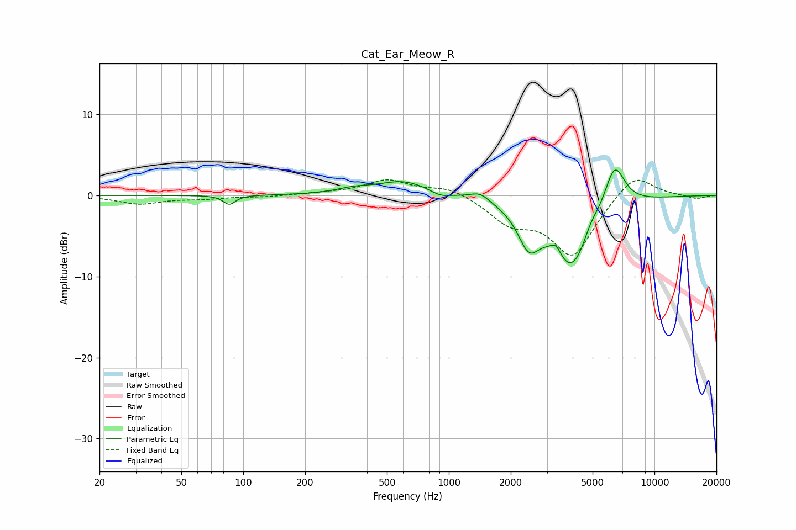

# Cat_Ear_Meow_R
See [usage instructions](https://github.com/jaakkopasanen/AutoEq#usage) for more options and info.

### Parametric EQs
Apply preamp of -3.2 dB when using parametric equalizer.

|   # | Type    |   Fc (Hz) |    Q |   Gain (dB) |
|-----|---------|-----------|------|-------------|
|   1 | Peaking |        86 | 4.9  |        -1.1 |
|   2 | Peaking |       342 | 1.83 |         0.5 |
|   3 | Peaking |       601 | 1.1  |         1.8 |
|   4 | Peaking |       909 | 2.9  |        -0.6 |
|   5 | Peaking |      1419 | 3.06 |         1   |
|   6 | Peaking |      2445 | 2.7  |        -4.3 |
|   7 | Peaking |      3318 | 5.58 |         1.3 |
|   8 | Peaking |      3973 | 1.36 |        -9.1 |
|   9 | Peaking |      4884 | 3.61 |         1.5 |
|  10 | Peaking |      6382 | 2.65 |         5.9 |

### Fixed Band EQs
When using fixed band (also called graphic) equalizer, apply preamp of **-2.0 dB** (if available) and set gains manually with these parameters.

|   # | Type    |   Fc (Hz) |    Q |   Gain (dB) |
|-----|---------|-----------|------|-------------|
|   1 | Peaking |        31 | 1.41 |        -1   |
|   2 | Peaking |        62 | 1.41 |        -0.3 |
|   3 | Peaking |       125 | 1.41 |        -0.2 |
|   4 | Peaking |       250 | 1.41 |         0.2 |
|   5 | Peaking |       500 | 1.41 |         1.8 |
|   6 | Peaking |      1000 | 1.41 |         1.1 |
|   7 | Peaking |      2000 | 1.41 |        -3   |
|   8 | Peaking |      4000 | 1.41 |        -7.3 |
|   9 | Peaking |      8000 | 1.41 |         3   |
|  10 | Peaking |     16000 | 1.41 |        -0.4 |

### Graphs

