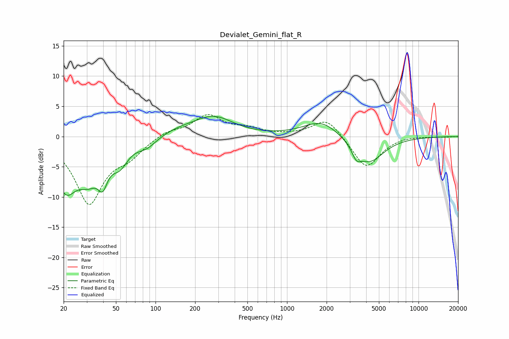

# Devialet_Gemini_flat_R
See [usage instructions](https://github.com/jaakkopasanen/AutoEq#usage) for more options and info.

### Parametric EQs
Apply preamp of -3.4 dB when using parametric equalizer.

|   # | Type    |   Fc (Hz) |    Q |   Gain (dB) |
|-----|---------|-----------|------|-------------|
|   1 | Peaking |        21 | 1.71 |        -7.6 |
|   2 | Peaking |        31 | 1.59 |        -5   |
|   3 | Peaking |        40 | 3.95 |        -3.7 |
|   4 | Peaking |        53 | 2.24 |        -3.3 |
|   5 | Peaking |        86 | 1.91 |        -1.6 |
|   6 | Peaking |       153 | 0.94 |         0.9 |
|   7 | Peaking |       279 | 0.95 |         3   |
|   8 | Peaking |      1831 | 1.05 |         2.7 |
|   9 | Peaking |      3361 | 4.48 |        -1.7 |
|  10 | Peaking |      4194 | 1.25 |        -4.4 |

### Fixed Band EQs
When using fixed band (also called graphic) equalizer, apply preamp of **-3.7 dB** (if available) and set gains manually with these parameters.

|   # | Type    |   Fc (Hz) |    Q |   Gain (dB) |
|-----|---------|-----------|------|-------------|
|   1 | Peaking |        31 | 1.41 |       -10.9 |
|   2 | Peaking |        62 | 1.41 |        -2.4 |
|   3 | Peaking |       125 | 1.41 |         1   |
|   4 | Peaking |       250 | 1.41 |         3.4 |
|   5 | Peaking |       500 | 1.41 |         1.1 |
|   6 | Peaking |      1000 | 1.41 |         0.1 |
|   7 | Peaking |      2000 | 1.41 |         3.2 |
|   8 | Peaking |      4000 | 1.41 |        -5.4 |
|   9 | Peaking |      8000 | 1.41 |         0.2 |
|  10 | Peaking |     16000 | 1.41 |        -0.1 |

### Graphs

