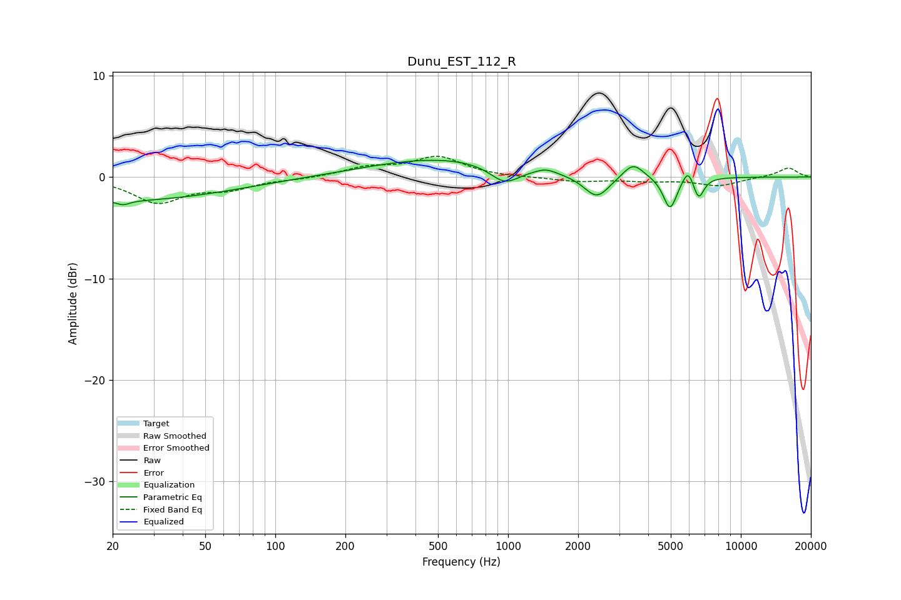

# Dunu_EST_112_R
See [usage instructions](https://github.com/jaakkopasanen/AutoEq#usage) for more options and info.

### Parametric EQs
Apply preamp of -1.7 dB when using parametric equalizer.

|   # | Type    |   Fc (Hz) |    Q |   Gain (dB) |
|-----|---------|-----------|------|-------------|
|   1 | Peaking |        20 | 0.28 |        -2.4 |
|   2 | Peaking |        22 | 5.36 |        -0.4 |
|   3 | Peaking |       522 | 0.45 |         1.9 |
|   4 | Peaking |       968 | 2.21 |        -1.7 |
|   5 | Peaking |      1452 | 3.19 |         0.5 |
|   6 | Peaking |      2406 | 2.56 |        -2.3 |
|   7 | Peaking |      3444 | 3.18 |         1.5 |
|   8 | Peaking |      4965 | 4.78 |        -3.2 |
|   9 | Peaking |      5934 | 6    |         1.4 |
|  10 | Peaking |      6587 | 6    |        -2.1 |

### Fixed Band EQs
When using fixed band (also called graphic) equalizer, apply preamp of **-2.1 dB** (if available) and set gains manually with these parameters.

|   # | Type    |   Fc (Hz) |    Q |   Gain (dB) |
|-----|---------|-----------|------|-------------|
|   1 | Peaking |        31 | 1.41 |        -2.4 |
|   2 | Peaking |        62 | 1.41 |        -1   |
|   3 | Peaking |       125 | 1.41 |        -0.2 |
|   4 | Peaking |       250 | 1.41 |         0.9 |
|   5 | Peaking |       500 | 1.41 |         1.9 |
|   6 | Peaking |      1000 | 1.41 |        -0.1 |
|   7 | Peaking |      2000 | 1.41 |        -0.4 |
|   8 | Peaking |      4000 | 1.41 |        -0.3 |
|   9 | Peaking |      8000 | 1.41 |        -0.8 |
|  10 | Peaking |     16000 | 1.41 |         0.9 |

### Graphs

