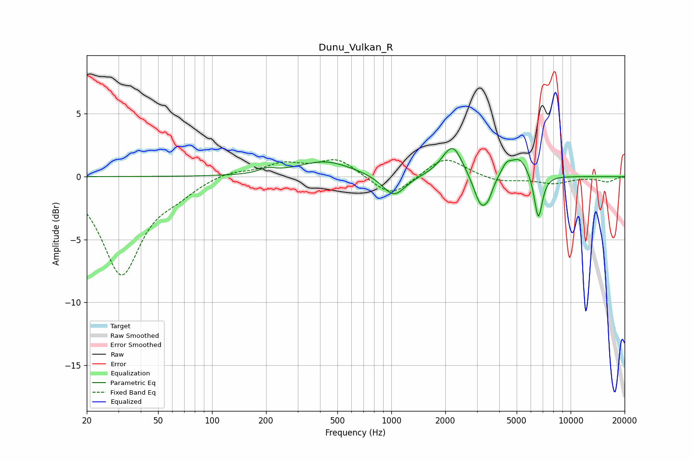

# Dunu_Vulkan_R
See [usage instructions](https://github.com/jaakkopasanen/AutoEq#usage) for more options and info.

### Parametric EQs
Apply preamp of -2.3 dB when using parametric equalizer.

|   # | Type    |   Fc (Hz) |    Q |   Gain (dB) |
|-----|---------|-----------|------|-------------|
|   1 | Peaking |       203 | 3.37 |         0.4 |
|   2 | Peaking |       427 | 0.93 |         1.2 |
|   3 | Peaking |      1033 | 2.21 |        -1.8 |
|   4 | Peaking |      2068 | 2.09 |         0.5 |
|   5 | Peaking |      2212 | 2.67 |         2.1 |
|   6 | Peaking |      3173 | 3.45 |        -2.6 |
|   7 | Peaking |      3489 | 6    |        -0.7 |
|   8 | Peaking |      4380 | 4.7  |         0.8 |
|   9 | Peaking |      5197 | 2.78 |         1.5 |
|  10 | Peaking |      6606 | 6    |        -3.6 |

### Fixed Band EQs
When using fixed band (also called graphic) equalizer, apply preamp of **-1.4 dB** (if available) and set gains manually with these parameters.

|   # | Type    |   Fc (Hz) |    Q |   Gain (dB) |
|-----|---------|-----------|------|-------------|
|   1 | Peaking |        31 | 1.41 |        -7.7 |
|   2 | Peaking |        62 | 1.41 |        -0.9 |
|   3 | Peaking |       125 | 1.41 |         0.5 |
|   4 | Peaking |       250 | 1.41 |         1   |
|   5 | Peaking |       500 | 1.41 |         1.4 |
|   6 | Peaking |      1000 | 1.41 |        -1.7 |
|   7 | Peaking |      2000 | 1.41 |         1.6 |
|   8 | Peaking |      4000 | 1.41 |        -0.4 |
|   9 | Peaking |      8000 | 1.41 |        -0.5 |
|  10 | Peaking |     16000 | 1.41 |        -0.4 |

### Graphs

