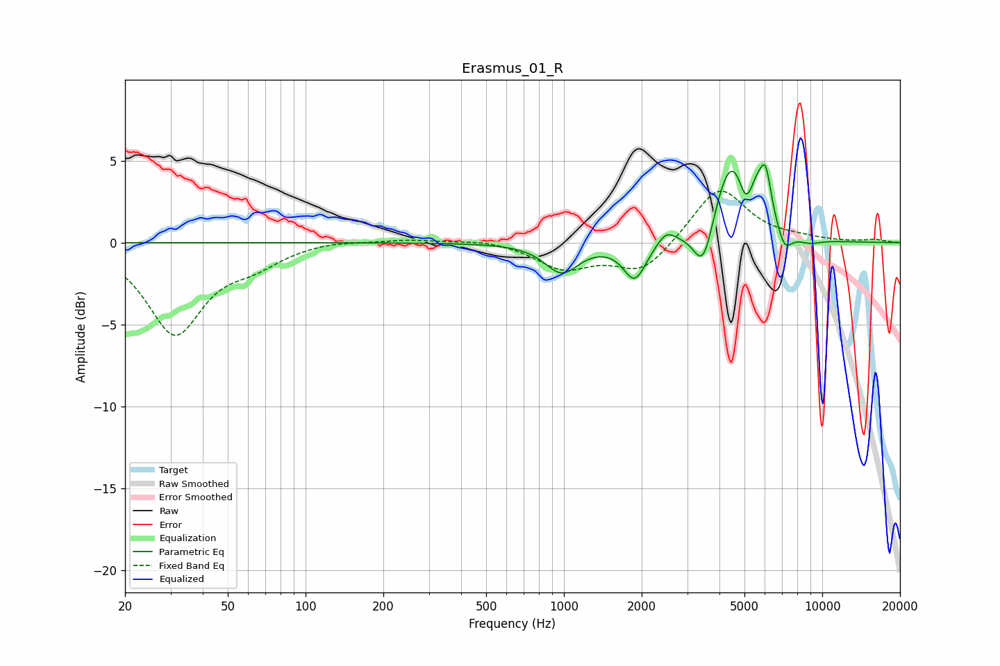

# Erasmus_01_R
See [usage instructions](https://github.com/jaakkopasanen/AutoEq#usage) for more options and info.

### Parametric EQs
Apply preamp of -4.8 dB when using parametric equalizer.

|   # | Type    |   Fc (Hz) |    Q |   Gain (dB) |
|-----|---------|-----------|------|-------------|
|   1 | Peaking |       982 | 2.19 |        -1.8 |
|   2 | Peaking |      1880 | 3.2  |        -2.3 |
|   3 | Peaking |      2487 | 4.14 |         0.8 |
|   4 | Peaking |      3468 | 3.62 |        -3   |
|   5 | Peaking |      4442 | 2.02 |         5.2 |
|   6 | Peaking |      5042 | 6    |        -1.3 |
|   7 | Peaking |      5597 | 6    |         1   |
|   8 | Peaking |      6036 | 6    |         3   |
|   9 | Peaking |      7155 | 4.96 |        -1.2 |
|  10 | Peaking |      8884 | 2.65 |        -0.3 |

### Fixed Band EQs
When using fixed band (also called graphic) equalizer, apply preamp of **-3.2 dB** (if available) and set gains manually with these parameters.

|   # | Type    |   Fc (Hz) |    Q |   Gain (dB) |
|-----|---------|-----------|------|-------------|
|   1 | Peaking |        31 | 1.41 |        -5.5 |
|   2 | Peaking |        62 | 1.41 |        -1   |
|   3 | Peaking |       125 | 1.41 |         0.2 |
|   4 | Peaking |       250 | 1.41 |         0.2 |
|   5 | Peaking |       500 | 1.41 |         0.2 |
|   6 | Peaking |      1000 | 1.41 |        -1.5 |
|   7 | Peaking |      2000 | 1.41 |        -1.8 |
|   8 | Peaking |      4000 | 1.41 |         3.5 |
|   9 | Peaking |      8000 | 1.41 |         0.2 |
|  10 | Peaking |     16000 | 1.41 |         0.2 |

### Graphs

