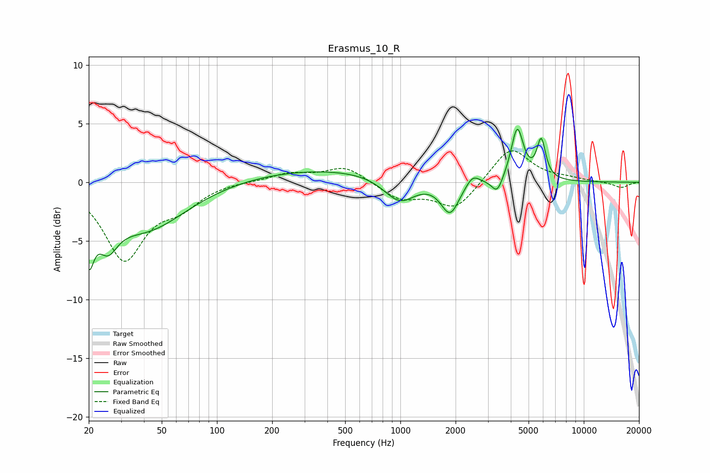

# Erasmus_10_R
See [usage instructions](https://github.com/jaakkopasanen/AutoEq#usage) for more options and info.

### Parametric EQs
Apply preamp of -4.6 dB when using parametric equalizer.

|   # | Type    |   Fc (Hz) |    Q |   Gain (dB) |
|-----|---------|-----------|------|-------------|
|   1 | Peaking |        20 | 5.19 |        -4.3 |
|   2 | Peaking |        25 | 2.63 |        -2.9 |
|   3 | Peaking |        41 | 0.64 |        -4   |
|   4 | Peaking |       399 | 0.3  |         1.2 |
|   5 | Peaking |       989 | 1.62 |        -2.2 |
|   6 | Peaking |      1866 | 2.84 |        -2.8 |
|   7 | Peaking |      2481 | 3.96 |         0.9 |
|   8 | Peaking |      3374 | 4.75 |        -1.4 |
|   9 | Peaking |      4337 | 4.24 |         4.5 |
|  10 | Peaking |      5862 | 5.86 |         3.3 |

### Fixed Band EQs
When using fixed band (also called graphic) equalizer, apply preamp of **-2.8 dB** (if available) and set gains manually with these parameters.

|   # | Type    |   Fc (Hz) |    Q |   Gain (dB) |
|-----|---------|-----------|------|-------------|
|   1 | Peaking |        31 | 1.41 |        -6.4 |
|   2 | Peaking |        62 | 1.41 |        -1.7 |
|   3 | Peaking |       125 | 1.41 |         0.1 |
|   4 | Peaking |       250 | 1.41 |         0.7 |
|   5 | Peaking |       500 | 1.41 |         1.3 |
|   6 | Peaking |      1000 | 1.41 |        -1.4 |
|   7 | Peaking |      2000 | 1.41 |        -2.3 |
|   8 | Peaking |      4000 | 1.41 |         3.1 |
|   9 | Peaking |      8000 | 1.41 |         0.3 |
|  10 | Peaking |     16000 | 1.41 |        -0.5 |

### Graphs

