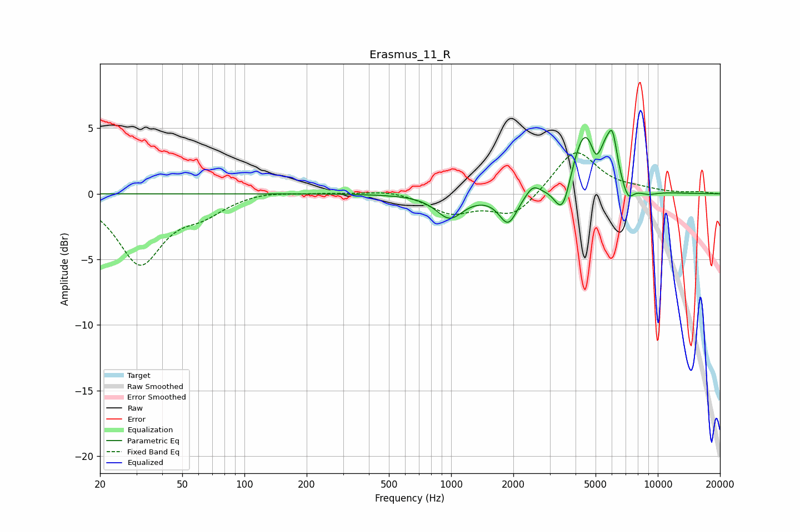

# Erasmus_11_R
See [usage instructions](https://github.com/jaakkopasanen/AutoEq#usage) for more options and info.

### Parametric EQs
Apply preamp of -4.9 dB when using parametric equalizer.

|   # | Type    |   Fc (Hz) |    Q |   Gain (dB) |
|-----|---------|-----------|------|-------------|
|   1 | Peaking |       984 | 2.18 |        -1.8 |
|   2 | Peaking |      1889 | 3.19 |        -2.3 |
|   3 | Peaking |      2482 | 4.18 |         0.8 |
|   4 | Peaking |      3468 | 3.55 |        -3   |
|   5 | Peaking |      4441 | 2.03 |         5.2 |
|   6 | Peaking |      4996 | 6    |        -1.3 |
|   7 | Peaking |      5601 | 6    |         1   |
|   8 | Peaking |      6040 | 6    |         3.1 |
|   9 | Peaking |      7169 | 4.99 |        -1.2 |
|  10 | Peaking |      8916 | 2.67 |        -0.3 |

### Fixed Band EQs
When using fixed band (also called graphic) equalizer, apply preamp of **-3.2 dB** (if available) and set gains manually with these parameters.

|   # | Type    |   Fc (Hz) |    Q |   Gain (dB) |
|-----|---------|-----------|------|-------------|
|   1 | Peaking |        31 | 1.41 |        -5.2 |
|   2 | Peaking |        62 | 1.41 |        -1.2 |
|   3 | Peaking |       125 | 1.41 |         0.3 |
|   4 | Peaking |       250 | 1.41 |         0.1 |
|   5 | Peaking |       500 | 1.41 |         0.3 |
|   6 | Peaking |      1000 | 1.41 |        -1.4 |
|   7 | Peaking |      2000 | 1.41 |        -1.8 |
|   8 | Peaking |      4000 | 1.41 |         3.4 |
|   9 | Peaking |      8000 | 1.41 |         0.2 |
|  10 | Peaking |     16000 | 1.41 |         0.1 |

### Graphs

