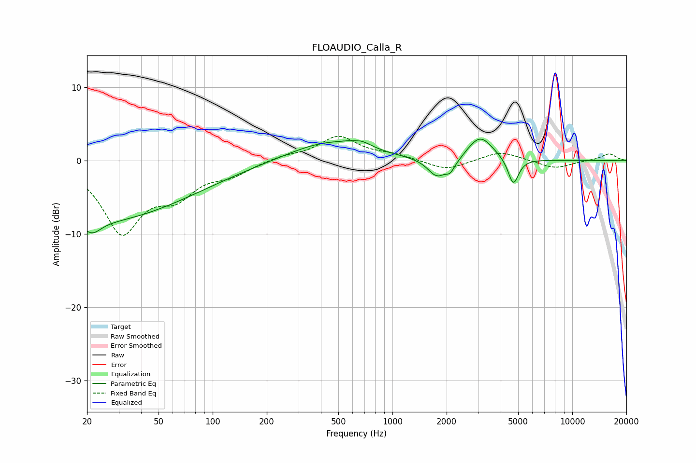

# FLOAUDIO_Calla_R
See [usage instructions](https://github.com/jaakkopasanen/AutoEq#usage) for more options and info.

### Parametric EQs
Apply preamp of -3.0 dB when using parametric equalizer.

|   # | Type    |   Fc (Hz) |    Q |   Gain (dB) |
|-----|---------|-----------|------|-------------|
|   1 | Peaking |        21 | 3.01 |        -1.6 |
|   2 | Peaking |        22 | 0.26 |        -8.2 |
|   3 | Peaking |       430 | 0.66 |         2.6 |
|   4 | Peaking |       619 | 5.86 |        -0.1 |
|   5 | Peaking |       654 | 2.2  |         1   |
|   6 | Peaking |      1769 | 2.73 |        -2.6 |
|   7 | Peaking |      2093 | 5.92 |        -1.1 |
|   8 | Peaking |      2278 | 3.01 |        -0.4 |
|   9 | Peaking |      3074 | 2    |         3.4 |
|  10 | Peaking |      4702 | 4.79 |        -3.7 |

### Fixed Band EQs
When using fixed band (also called graphic) equalizer, apply preamp of **-3.4 dB** (if available) and set gains manually with these parameters.

|   # | Type    |   Fc (Hz) |    Q |   Gain (dB) |
|-----|---------|-----------|------|-------------|
|   1 | Peaking |        31 | 1.41 |        -9.4 |
|   2 | Peaking |        62 | 1.41 |        -3.9 |
|   3 | Peaking |       125 | 1.41 |        -1.6 |
|   4 | Peaking |       250 | 1.41 |         0.6 |
|   5 | Peaking |       500 | 1.41 |         3.2 |
|   6 | Peaking |      1000 | 1.41 |         0.7 |
|   7 | Peaking |      2000 | 1.41 |        -1.4 |
|   8 | Peaking |      4000 | 1.41 |         1.3 |
|   9 | Peaking |      8000 | 1.41 |        -1.1 |
|  10 | Peaking |     16000 | 1.41 |         1   |

### Graphs

