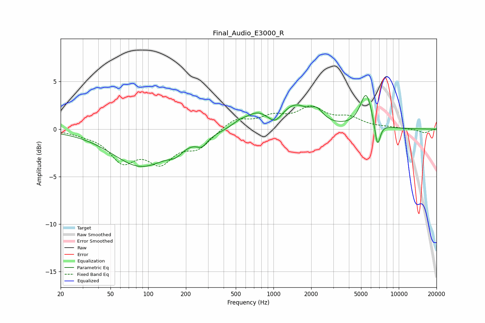

# Final_Audio_E3000_R
See [usage instructions](https://github.com/jaakkopasanen/AutoEq#usage) for more options and info.

### Parametric EQs
Apply preamp of -3.6 dB when using parametric equalizer.

|   # | Type    |   Fc (Hz) |    Q |   Gain (dB) |
|-----|---------|-----------|------|-------------|
|   1 | Peaking |        88 | 0.62 |        -3.9 |
|   2 | Peaking |       166 | 2.47 |        -0.8 |
|   3 | Peaking |       269 | 3.29 |        -0.9 |
|   4 | Peaking |       536 | 2.31 |         0.5 |
|   5 | Peaking |       740 | 1.61 |         1.4 |
|   6 | Peaking |      1029 | 2.91 |        -0.9 |
|   7 | Peaking |      1477 | 1.31 |         2.3 |
|   8 | Peaking |      2213 | 2.82 |         1.1 |
|   9 | Peaking |      5495 | 2.88 |         3.7 |
|  10 | Peaking |      6756 | 5.92 |        -2.8 |

### Fixed Band EQs
When using fixed band (also called graphic) equalizer, apply preamp of **-2.5 dB** (if available) and set gains manually with these parameters.

|   # | Type    |   Fc (Hz) |    Q |   Gain (dB) |
|-----|---------|-----------|------|-------------|
|   1 | Peaking |        31 | 1.41 |        -0.3 |
|   2 | Peaking |        62 | 1.41 |        -3.1 |
|   3 | Peaking |       125 | 1.41 |        -3.1 |
|   4 | Peaking |       250 | 1.41 |        -1.8 |
|   5 | Peaking |       500 | 1.41 |         1.1 |
|   6 | Peaking |      1000 | 1.41 |         1.1 |
|   7 | Peaking |      2000 | 1.41 |         2   |
|   8 | Peaking |      4000 | 1.41 |         1   |
|   9 | Peaking |      8000 | 1.41 |         0.1 |
|  10 | Peaking |     16000 | 1.41 |        -0.4 |

### Graphs

