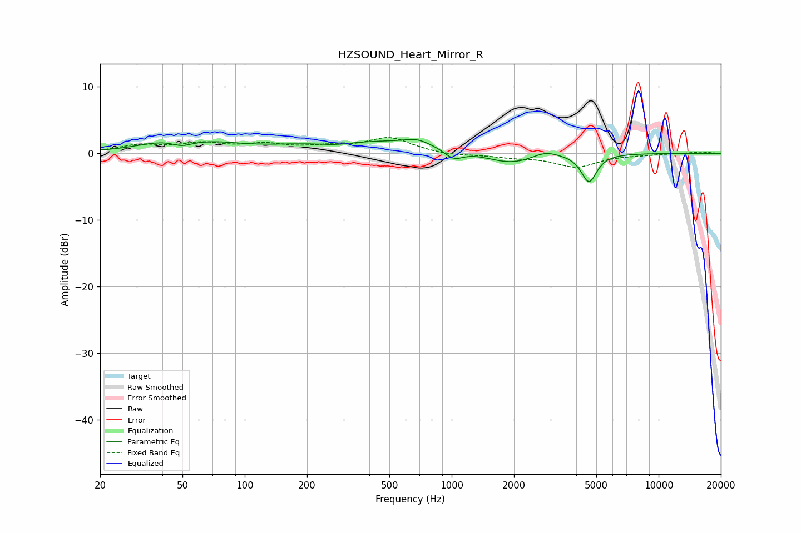

# HZSOUND_Heart_Mirror_R
See [usage instructions](https://github.com/jaakkopasanen/AutoEq#usage) for more options and info.

### Parametric EQs
Apply preamp of -2.2 dB when using parametric equalizer.

|   # | Type    |   Fc (Hz) |    Q |   Gain (dB) |
|-----|---------|-----------|------|-------------|
|   1 | Peaking |        43 | 0.99 |         1.5 |
|   2 | Peaking |        49 | 2.84 |        -0.9 |
|   3 | Peaking |        73 | 1.15 |         0.7 |
|   4 | Peaking |       274 | 1.66 |        -0.5 |
|   5 | Peaking |       582 | 0.23 |         2.1 |
|   6 | Peaking |       676 | 2.62 |         0.7 |
|   7 | Peaking |      1021 | 2.88 |        -1.7 |
|   8 | Peaking |      1911 | 0.92 |        -2.7 |
|   9 | Peaking |      2817 | 2.26 |         1   |
|  10 | Peaking |      4609 | 3.82 |        -4.3 |

### Fixed Band EQs
When using fixed band (also called graphic) equalizer, apply preamp of **-2.5 dB** (if available) and set gains manually with these parameters.

|   # | Type    |   Fc (Hz) |    Q |   Gain (dB) |
|-----|---------|-----------|------|-------------|
|   1 | Peaking |        31 | 1.41 |         1.1 |
|   2 | Peaking |        62 | 1.41 |         1.3 |
|   3 | Peaking |       125 | 1.41 |         1.1 |
|   4 | Peaking |       250 | 1.41 |         0.8 |
|   5 | Peaking |       500 | 1.41 |         2.3 |
|   6 | Peaking |      1000 | 1.41 |        -0.4 |
|   7 | Peaking |      2000 | 1.41 |        -0.5 |
|   8 | Peaking |      4000 | 1.41 |        -2   |
|   9 | Peaking |      8000 | 1.41 |        -0.1 |
|  10 | Peaking |     16000 | 1.41 |         0.2 |

### Graphs

