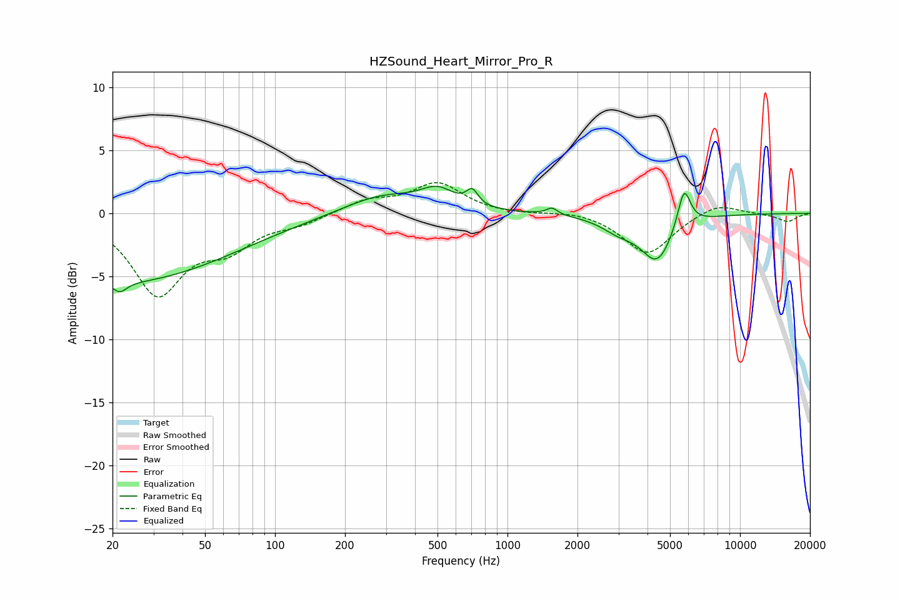

# HZSound_Heart_Mirror_Pro_R
See [usage instructions](https://github.com/jaakkopasanen/AutoEq#usage) for more options and info.

### Parametric EQs
Apply preamp of -2.2 dB when using parametric equalizer.

|   # | Type    |   Fc (Hz) |    Q |   Gain (dB) |
|-----|---------|-----------|------|-------------|
|   1 | Peaking |        22 | 4.87 |        -0.8 |
|   2 | Peaking |        22 | 0.29 |        -5.4 |
|   3 | Peaking |       287 | 0.86 |         1.5 |
|   4 | Peaking |       500 | 1.92 |         1.5 |
|   5 | Peaking |       705 | 5.75 |         1.2 |
|   6 | Peaking |      1553 | 5.95 |         0.5 |
|   7 | Peaking |      3004 | 1.85 |        -1   |
|   8 | Peaking |      4371 | 1.88 |        -3.1 |
|   9 | Peaking |      4480 | 2.95 |        -0.5 |
|  10 | Peaking |      5743 | 4.98 |         3.2 |

### Fixed Band EQs
When using fixed band (also called graphic) equalizer, apply preamp of **-2.5 dB** (if available) and set gains manually with these parameters.

|   # | Type    |   Fc (Hz) |    Q |   Gain (dB) |
|-----|---------|-----------|------|-------------|
|   1 | Peaking |        31 | 1.41 |        -6.2 |
|   2 | Peaking |        62 | 1.41 |        -2.3 |
|   3 | Peaking |       125 | 1.41 |        -0.7 |
|   4 | Peaking |       250 | 1.41 |         1   |
|   5 | Peaking |       500 | 1.41 |         2.3 |
|   6 | Peaking |      1000 | 1.41 |        -0.1 |
|   7 | Peaking |      2000 | 1.41 |         0.3 |
|   8 | Peaking |      4000 | 1.41 |        -3.3 |
|   9 | Peaking |      8000 | 1.41 |         0.9 |
|  10 | Peaking |     16000 | 1.41 |        -0.7 |

### Graphs

