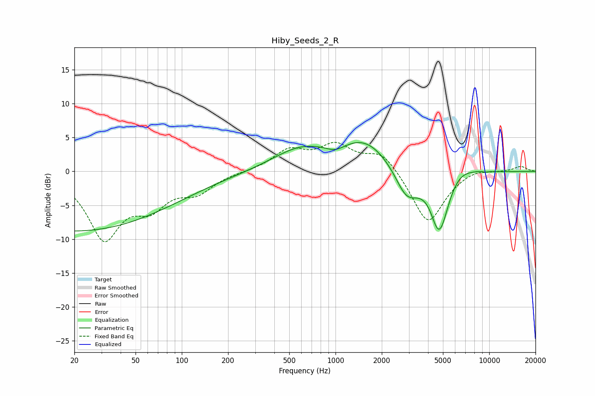

# Hiby_Seeds_2_R
See [usage instructions](https://github.com/jaakkopasanen/AutoEq#usage) for more options and info.

### Parametric EQs
Apply preamp of -4.3 dB when using parametric equalizer.

|   # | Type    |   Fc (Hz) |    Q |   Gain (dB) |
|-----|---------|-----------|------|-------------|
|   1 | Peaking |        20 | 0.21 |        -8.8 |
|   2 | Peaking |       593 | 0.75 |         3.1 |
|   3 | Peaking |      1000 | 2.31 |        -0.9 |
|   4 | Peaking |      1563 | 0.84 |         4.3 |
|   5 | Peaking |      2893 | 1.89 |        -4.2 |
|   6 | Peaking |      4113 | 2.41 |         1.3 |
|   7 | Peaking |      4717 | 2.03 |       -10.7 |
|   8 | Peaking |      6134 | 1.43 |         2.3 |
|   9 | Peaking |      9117 | 2.47 |         0.2 |
|  10 | Peaking |      9416 | 6    |        -0.2 |

### Fixed Band EQs
When using fixed band (also called graphic) equalizer, apply preamp of **-4.4 dB** (if available) and set gains manually with these parameters.

|   # | Type    |   Fc (Hz) |    Q |   Gain (dB) |
|-----|---------|-----------|------|-------------|
|   1 | Peaking |        31 | 1.41 |        -9.5 |
|   2 | Peaking |        62 | 1.41 |        -4.2 |
|   3 | Peaking |       125 | 1.41 |        -2.7 |
|   4 | Peaking |       250 | 1.41 |        -0   |
|   5 | Peaking |       500 | 1.41 |         2.9 |
|   6 | Peaking |      1000 | 1.41 |         3.5 |
|   7 | Peaking |      2000 | 1.41 |         3   |
|   8 | Peaking |      4000 | 1.41 |        -7.9 |
|   9 | Peaking |      8000 | 1.41 |         0.7 |
|  10 | Peaking |     16000 | 1.41 |         0.8 |

### Graphs

