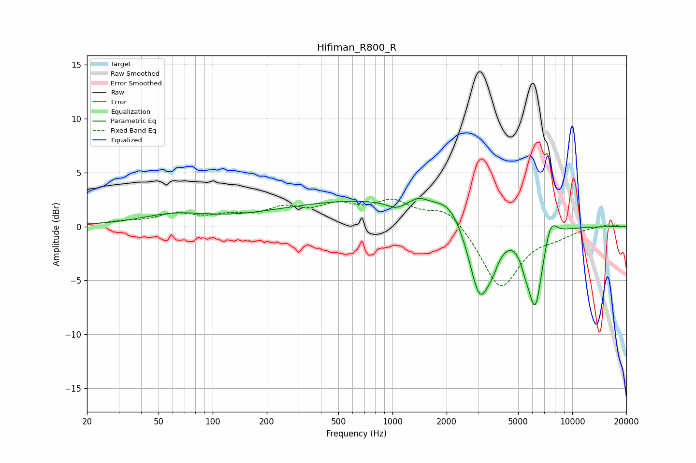

# Hifiman_R800_R
See [usage instructions](https://github.com/jaakkopasanen/AutoEq#usage) for more options and info.

### Parametric EQs
Apply preamp of -2.7 dB when using parametric equalizer.

|   # | Type    |   Fc (Hz) |    Q |   Gain (dB) |
|-----|---------|-----------|------|-------------|
|   1 | Peaking |        61 | 0.75 |         1   |
|   2 | Peaking |       775 | 0.25 |         2.4 |
|   3 | Peaking |      1044 | 2.76 |        -0.7 |
|   4 | Peaking |      1406 | 3.03 |         0.6 |
|   5 | Peaking |      2075 | 1.75 |         1.5 |
|   6 | Peaking |      3059 | 2.27 |        -7.4 |
|   7 | Peaking |      3616 | 4.07 |        -1.1 |
|   8 | Peaking |      5468 | 5.61 |        -1.1 |
|   9 | Peaking |      6218 | 3.37 |        -7.3 |
|  10 | Peaking |      7581 | 3.98 |         2   |

### Fixed Band EQs
When using fixed band (also called graphic) equalizer, apply preamp of **-2.6 dB** (if available) and set gains manually with these parameters.

|   # | Type    |   Fc (Hz) |    Q |   Gain (dB) |
|-----|---------|-----------|------|-------------|
|   1 | Peaking |        31 | 1.41 |         0.3 |
|   2 | Peaking |        62 | 1.41 |         1   |
|   3 | Peaking |       125 | 1.41 |         0.8 |
|   4 | Peaking |       250 | 1.41 |         1.4 |
|   5 | Peaking |       500 | 1.41 |         1.6 |
|   6 | Peaking |      1000 | 1.41 |         2.1 |
|   7 | Peaking |      2000 | 1.41 |         1.8 |
|   8 | Peaking |      4000 | 1.41 |        -5.8 |
|   9 | Peaking |      8000 | 1.41 |        -0.7 |
|  10 | Peaking |     16000 | 1.41 |         0.2 |

### Graphs

