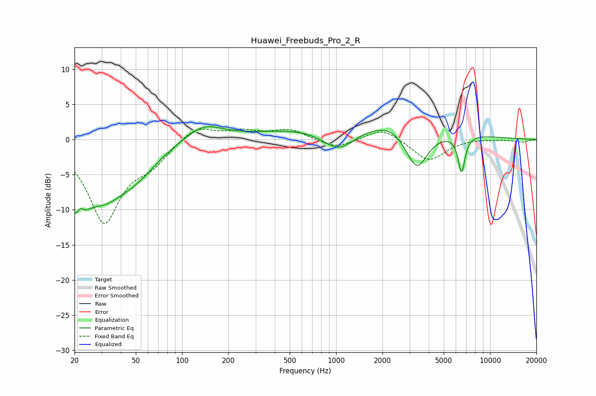

# Huawei_Freebuds_Pro_2_R
See [usage instructions](https://github.com/jaakkopasanen/AutoEq#usage) for more options and info.

### Parametric EQs
Apply preamp of -1.9 dB when using parametric equalizer.

|   # | Type    |   Fc (Hz) |    Q |   Gain (dB) |
|-----|---------|-----------|------|-------------|
|   1 | Peaking |        21 | 2.23 |        -7.4 |
|   2 | Peaking |        22 | 5.78 |         2   |
|   3 | Peaking |        31 | 0.89 |        -6.8 |
|   4 | Peaking |        52 | 1.11 |        -2.5 |
|   5 | Peaking |       138 | 1.17 |         2.3 |
|   6 | Peaking |      1038 | 1.31 |        -3.3 |
|   7 | Peaking |      1573 | 0.22 |         2.3 |
|   8 | Peaking |      2293 | 1.32 |         1.1 |
|   9 | Peaking |      3335 | 1.88 |        -5.9 |
|  10 | Peaking |      6526 | 5.98 |        -5.3 |

### Fixed Band EQs
When using fixed band (also called graphic) equalizer, apply preamp of **-1.6 dB** (if available) and set gains manually with these parameters.

|   # | Type    |   Fc (Hz) |    Q |   Gain (dB) |
|-----|---------|-----------|------|-------------|
|   1 | Peaking |        31 | 1.41 |       -11.6 |
|   2 | Peaking |        62 | 1.41 |        -2.6 |
|   3 | Peaking |       125 | 1.41 |         2.1 |
|   4 | Peaking |       250 | 1.41 |         1.1 |
|   5 | Peaking |       500 | 1.41 |         1.4 |
|   6 | Peaking |      1000 | 1.41 |        -1.3 |
|   7 | Peaking |      2000 | 1.41 |         1.7 |
|   8 | Peaking |      4000 | 1.41 |        -3.1 |
|   9 | Peaking |      8000 | 1.41 |         0.2 |
|  10 | Peaking |     16000 | 1.41 |        -0.4 |

### Graphs

