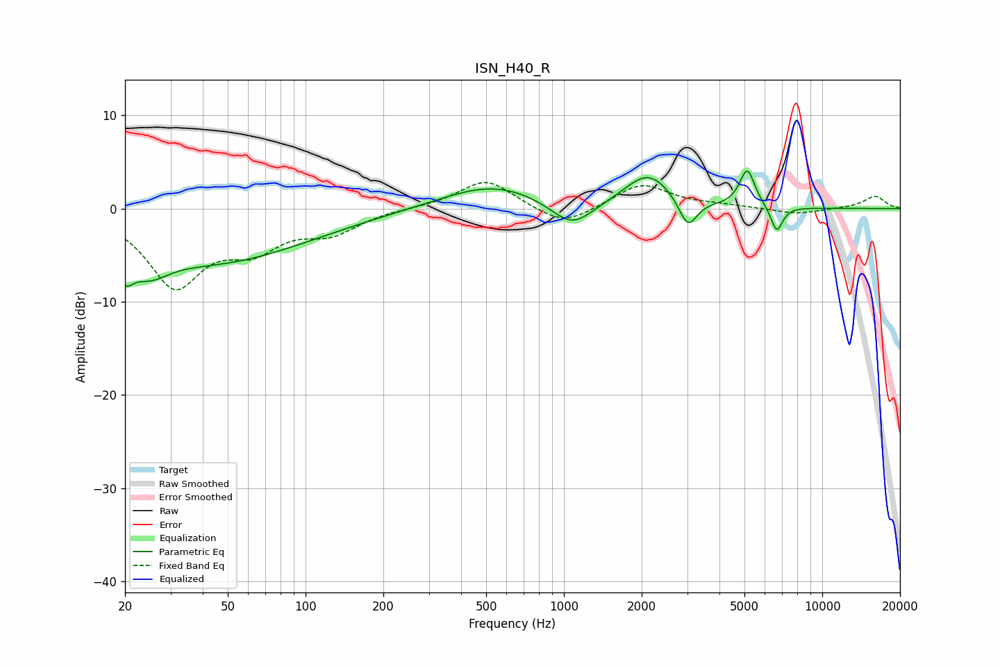

# ISN_H40_R
See [usage instructions](https://github.com/jaakkopasanen/AutoEq#usage) for more options and info.

### Parametric EQs
Apply preamp of -4.1 dB when using parametric equalizer.

|   # | Type    |   Fc (Hz) |    Q |   Gain (dB) |
|-----|---------|-----------|------|-------------|
|   1 | Peaking |        20 | 4.52 |        -2.7 |
|   2 | Peaking |        25 | 1.9  |        -2.5 |
|   3 | Peaking |        43 | 0.37 |        -5.7 |
|   4 | Peaking |       528 | 0.73 |         2.6 |
|   5 | Peaking |      1075 | 1.72 |        -2.9 |
|   6 | Peaking |      2114 | 1.48 |         3.1 |
|   7 | Peaking |      2149 | 1.85 |         0.7 |
|   8 | Peaking |      3019 | 4    |        -3.2 |
|   9 | Peaking |      5126 | 4.7  |         4.1 |
|  10 | Peaking |      6667 | 5.91 |        -2.8 |

### Fixed Band EQs
When using fixed band (also called graphic) equalizer, apply preamp of **-2.9 dB** (if available) and set gains manually with these parameters.

|   # | Type    |   Fc (Hz) |    Q |   Gain (dB) |
|-----|---------|-----------|------|-------------|
|   1 | Peaking |        31 | 1.41 |        -8   |
|   2 | Peaking |        62 | 1.41 |        -3.5 |
|   3 | Peaking |       125 | 1.41 |        -2.3 |
|   4 | Peaking |       250 | 1.41 |         0.1 |
|   5 | Peaking |       500 | 1.41 |         3.2 |
|   6 | Peaking |      1000 | 1.41 |        -2   |
|   7 | Peaking |      2000 | 1.41 |         2.7 |
|   8 | Peaking |      4000 | 1.41 |         0.3 |
|   9 | Peaking |      8000 | 1.41 |        -0.6 |
|  10 | Peaking |     16000 | 1.41 |         1.3 |

### Graphs

