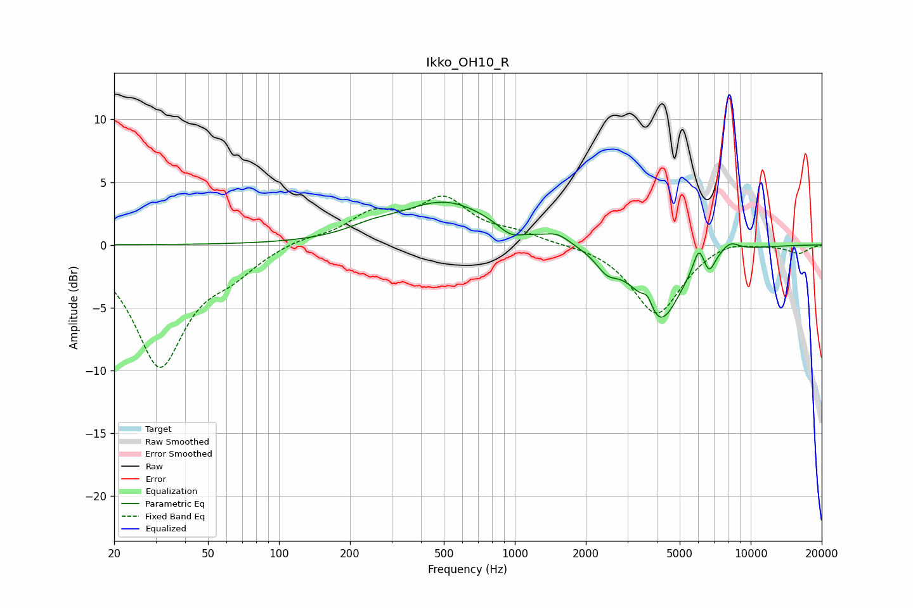

# Ikko_OH10_R
See [usage instructions](https://github.com/jaakkopasanen/AutoEq#usage) for more options and info.

### Parametric EQs
Apply preamp of -3.5 dB when using parametric equalizer.

|   # | Type    |   Fc (Hz) |    Q |   Gain (dB) |
|-----|---------|-----------|------|-------------|
|   1 | Peaking |       244 | 1.44 |         0.6 |
|   2 | Peaking |       509 | 0.71 |         3.4 |
|   3 | Peaking |       956 | 2.84 |        -0.8 |
|   4 | Peaking |      1520 | 2.71 |         0.7 |
|   5 | Peaking |      2459 | 3.07 |        -1.3 |
|   6 | Peaking |      3653 | 6    |         1.3 |
|   7 | Peaking |      4096 | 1.56 |        -6.2 |
|   8 | Peaking |      6024 | 6    |         1.8 |
|   9 | Peaking |      6673 | 6    |        -1.3 |
|  10 | Peaking |      8161 | 3.24 |         0.9 |

### Fixed Band EQs
When using fixed band (also called graphic) equalizer, apply preamp of **-4.0 dB** (if available) and set gains manually with these parameters.

|   # | Type    |   Fc (Hz) |    Q |   Gain (dB) |
|-----|---------|-----------|------|-------------|
|   1 | Peaking |        31 | 1.41 |        -9.5 |
|   2 | Peaking |        62 | 1.41 |        -1.6 |
|   3 | Peaking |       125 | 1.41 |         0.5 |
|   4 | Peaking |       250 | 1.41 |         2.2 |
|   5 | Peaking |       500 | 1.41 |         3.4 |
|   6 | Peaking |      1000 | 1.41 |         0.8 |
|   7 | Peaking |      2000 | 1.41 |         0.1 |
|   8 | Peaking |      4000 | 1.41 |        -5.6 |
|   9 | Peaking |      8000 | 1.41 |         0.6 |
|  10 | Peaking |     16000 | 1.41 |        -0.7 |

### Graphs

