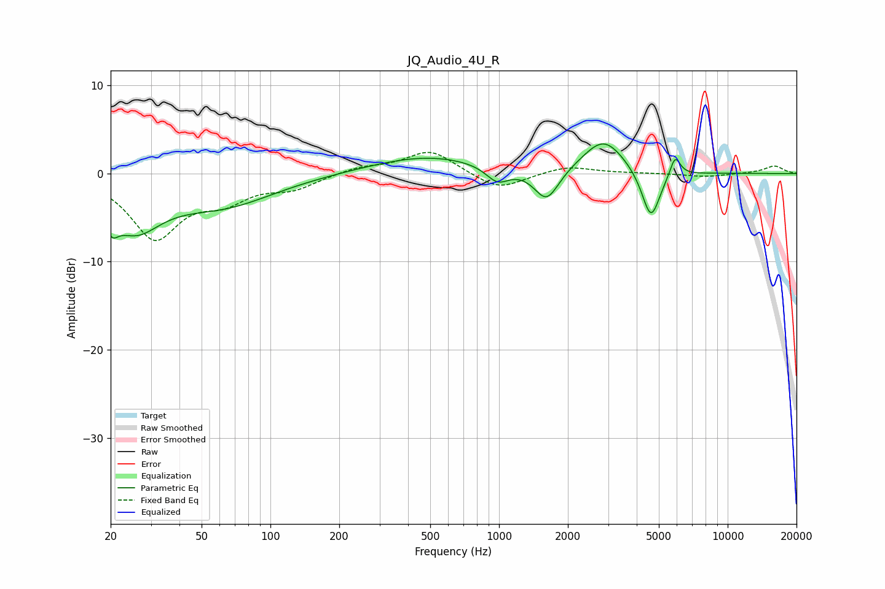

# JQ_Audio_4U_R
See [usage instructions](https://github.com/jaakkopasanen/AutoEq#usage) for more options and info.

### Parametric EQs
Apply preamp of -3.5 dB when using parametric equalizer.

|   # | Type    |   Fc (Hz) |    Q |   Gain (dB) |
|-----|---------|-----------|------|-------------|
|   1 | Peaking |        20 | 5.57 |         3.2 |
|   2 | Peaking |        20 | 5.28 |        -5.6 |
|   3 | Peaking |        25 | 1.23 |        -5.3 |
|   4 | Peaking |        61 | 0.62 |        -3.4 |
|   5 | Peaking |       487 | 0.57 |         2   |
|   6 | Peaking |       984 | 2.82 |        -1.8 |
|   7 | Peaking |      1615 | 2.62 |        -3.7 |
|   8 | Peaking |      2870 | 1.55 |         4   |
|   9 | Peaking |      4617 | 3.48 |        -5.7 |
|  10 | Peaking |      5888 | 6    |         2.4 |

### Fixed Band EQs
When using fixed band (also called graphic) equalizer, apply preamp of **-2.5 dB** (if available) and set gains manually with these parameters.

|   # | Type    |   Fc (Hz) |    Q |   Gain (dB) |
|-----|---------|-----------|------|-------------|
|   1 | Peaking |        31 | 1.41 |        -7.1 |
|   2 | Peaking |        62 | 1.41 |        -2.5 |
|   3 | Peaking |       125 | 1.41 |        -1.5 |
|   4 | Peaking |       250 | 1.41 |         0.7 |
|   5 | Peaking |       500 | 1.41 |         2.7 |
|   6 | Peaking |      1000 | 1.41 |        -1.9 |
|   7 | Peaking |      2000 | 1.41 |         0.9 |
|   8 | Peaking |      4000 | 1.41 |         0   |
|   9 | Peaking |      8000 | 1.41 |        -0.4 |
|  10 | Peaking |     16000 | 1.41 |         0.9 |

### Graphs

