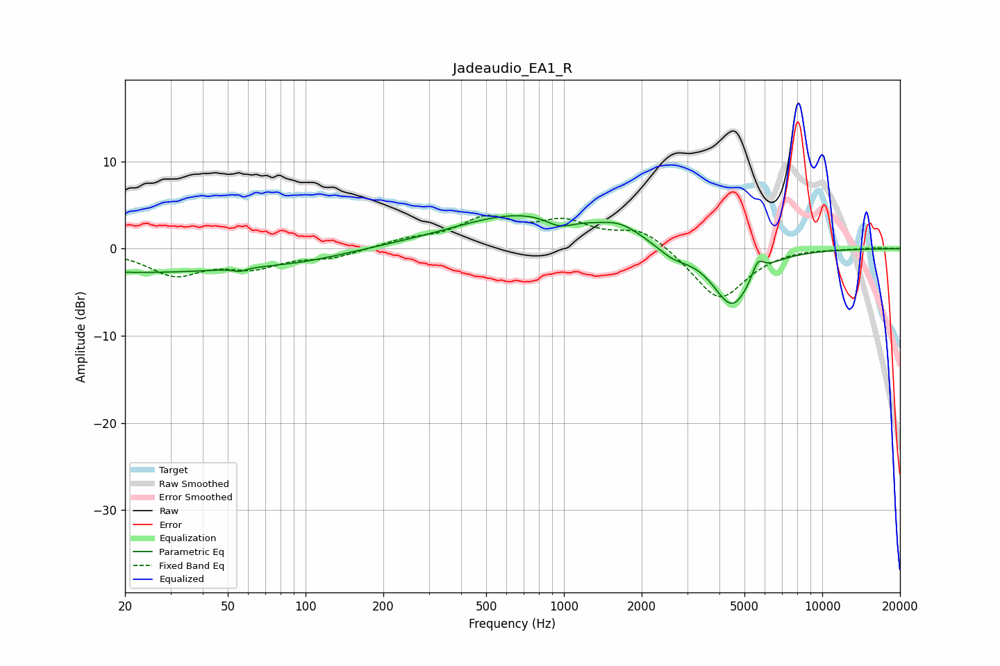

# Jadeaudio_EA1_R
See [usage instructions](https://github.com/jaakkopasanen/AutoEq#usage) for more options and info.

### Parametric EQs
Apply preamp of -3.9 dB when using parametric equalizer.

|   # | Type    |   Fc (Hz) |    Q |   Gain (dB) |
|-----|---------|-----------|------|-------------|
|   1 | Peaking |        22 | 0.27 |        -2.7 |
|   2 | Peaking |        55 | 6    |         2.1 |
|   3 | Peaking |        55 | 5.95 |        -2.5 |
|   4 | Peaking |        99 | 0.83 |        -0.6 |
|   5 | Peaking |       718 | 0.51 |         4.1 |
|   6 | Peaking |       962 | 2.62 |        -1.2 |
|   7 | Peaking |      1662 | 1.77 |         1.4 |
|   8 | Peaking |      2646 | 2.26 |        -1.2 |
|   9 | Peaking |      4486 | 1.8  |        -6.7 |
|  10 | Peaking |      5631 | 6    |         1.9 |

### Fixed Band EQs
When using fixed band (also called graphic) equalizer, apply preamp of **-3.9 dB** (if available) and set gains manually with these parameters.

|   # | Type    |   Fc (Hz) |    Q |   Gain (dB) |
|-----|---------|-----------|------|-------------|
|   1 | Peaking |        31 | 1.41 |        -2.9 |
|   2 | Peaking |        62 | 1.41 |        -1.9 |
|   3 | Peaking |       125 | 1.41 |        -1   |
|   4 | Peaking |       250 | 1.41 |         0.9 |
|   5 | Peaking |       500 | 1.41 |         3.2 |
|   6 | Peaking |      1000 | 1.41 |         2.7 |
|   7 | Peaking |      2000 | 1.41 |         2.3 |
|   8 | Peaking |      4000 | 1.41 |        -6   |
|   9 | Peaking |      8000 | 1.41 |         0.2 |
|  10 | Peaking |     16000 | 1.41 |         0.1 |

### Graphs

