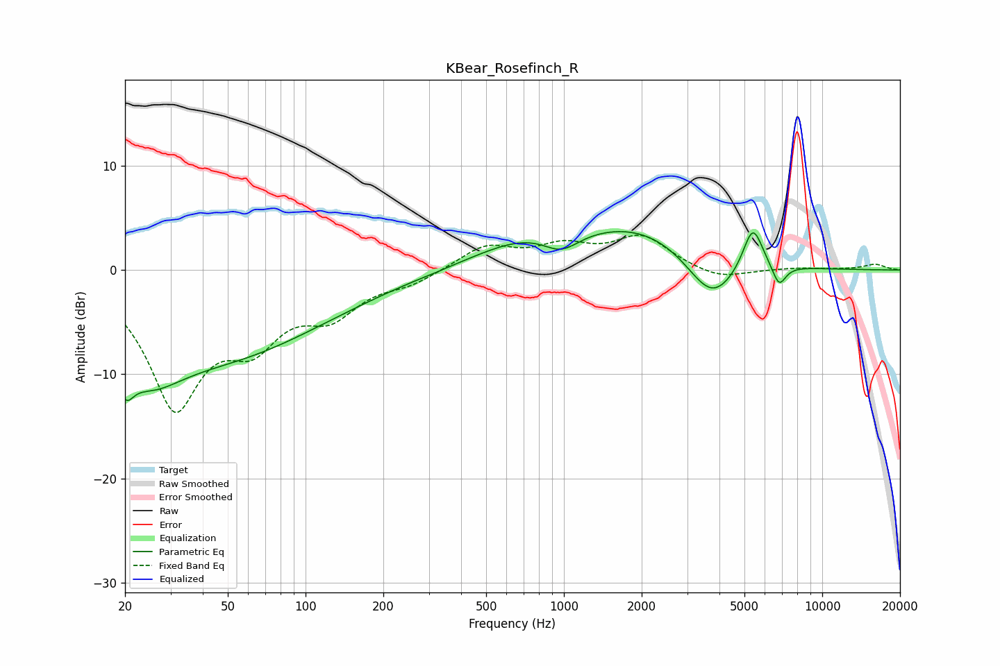

# KBear_Rosefinch_R
See [usage instructions](https://github.com/jaakkopasanen/AutoEq#usage) for more options and info.

### Parametric EQs
Apply preamp of -3.8 dB when using parametric equalizer.

|   # | Type    |   Fc (Hz) |    Q |   Gain (dB) |
|-----|---------|-----------|------|-------------|
|   1 | Peaking |        20 | 4.52 |        -3.2 |
|   2 | Peaking |        24 | 1.06 |        -5.2 |
|   3 | Peaking |        50 | 0.36 |        -7.6 |
|   4 | Peaking |       314 | 5.67 |        -0   |
|   5 | Peaking |       712 | 0.68 |         2.4 |
|   6 | Peaking |       975 | 1.98 |        -1.9 |
|   7 | Peaking |      1991 | 0.55 |         3.9 |
|   8 | Peaking |      3733 | 1.43 |        -4.7 |
|   9 | Peaking |      5387 | 3.58 |         4.4 |
|  10 | Peaking |      6806 | 5.17 |        -2.1 |

### Fixed Band EQs
When using fixed band (also called graphic) equalizer, apply preamp of **-3.4 dB** (if available) and set gains manually with these parameters.

|   # | Type    |   Fc (Hz) |    Q |   Gain (dB) |
|-----|---------|-----------|------|-------------|
|   1 | Peaking |        31 | 1.41 |       -12.5 |
|   2 | Peaking |        62 | 1.41 |        -5.3 |
|   3 | Peaking |       125 | 1.41 |        -3.6 |
|   4 | Peaking |       250 | 1.41 |        -1.1 |
|   5 | Peaking |       500 | 1.41 |         2.3 |
|   6 | Peaking |      1000 | 1.41 |         2   |
|   7 | Peaking |      2000 | 1.41 |         3.1 |
|   8 | Peaking |      4000 | 1.41 |        -1   |
|   9 | Peaking |      8000 | 1.41 |         0.2 |
|  10 | Peaking |     16000 | 1.41 |         0.5 |

### Graphs

