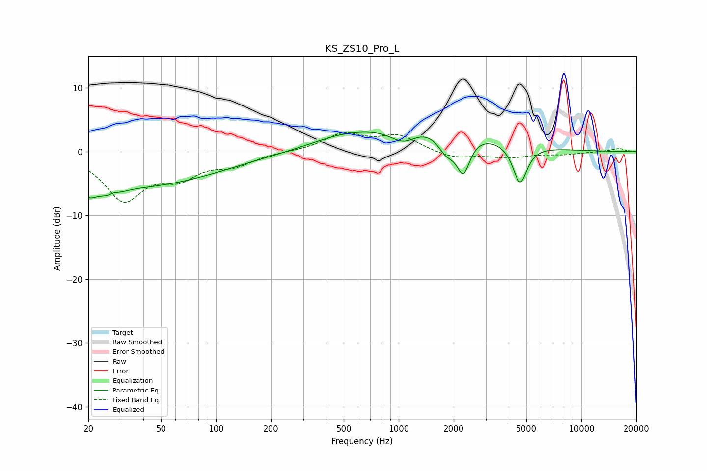

# KS_ZS10_Pro_L
See [usage instructions](https://github.com/jaakkopasanen/AutoEq#usage) for more options and info.

### Parametric EQs
Apply preamp of -3.2 dB when using parametric equalizer.

|   # | Type    |   Fc (Hz) |    Q |   Gain (dB) |
|-----|---------|-----------|------|-------------|
|   1 | Peaking |        20 | 3.43 |        -2.3 |
|   2 | Peaking |        26 | 2.08 |        -1.9 |
|   3 | Peaking |        27 | 5.54 |         0.5 |
|   4 | Peaking |        40 | 0.34 |        -5.2 |
|   5 | Peaking |       478 | 0.81 |         1.2 |
|   6 | Peaking |      1060 | 1.85 |        -2.6 |
|   7 | Peaking |      1462 | 0.44 |         4.8 |
|   8 | Peaking |      1827 | 2.76 |        -3.3 |
|   9 | Peaking |      2260 | 3.8  |        -5.8 |
|  10 | Peaking |      4614 | 3.59 |        -6.3 |

### Fixed Band EQs
When using fixed band (also called graphic) equalizer, apply preamp of **-3.1 dB** (if available) and set gains manually with these parameters.

|   # | Type    |   Fc (Hz) |    Q |   Gain (dB) |
|-----|---------|-----------|------|-------------|
|   1 | Peaking |        31 | 1.41 |        -7.3 |
|   2 | Peaking |        62 | 1.41 |        -3.3 |
|   3 | Peaking |       125 | 1.41 |        -1.8 |
|   4 | Peaking |       250 | 1.41 |         0   |
|   5 | Peaking |       500 | 1.41 |         2.7 |
|   6 | Peaking |      1000 | 1.41 |         2.4 |
|   7 | Peaking |      2000 | 1.41 |        -1.1 |
|   8 | Peaking |      4000 | 1.41 |        -0.9 |
|   9 | Peaking |      8000 | 1.41 |        -0.4 |
|  10 | Peaking |     16000 | 1.41 |         0.5 |

### Graphs

