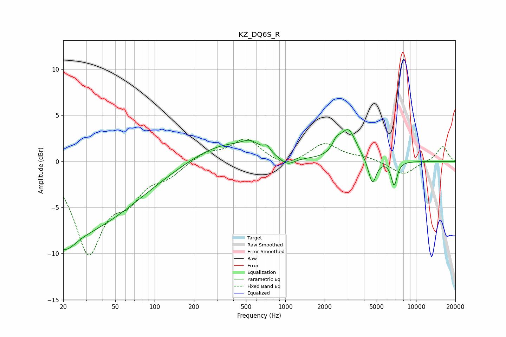

# KZ_DQ6S_R
See [usage instructions](https://github.com/jaakkopasanen/AutoEq#usage) for more options and info.

### Parametric EQs
Apply preamp of -3.5 dB when using parametric equalizer.

|   # | Type    |   Fc (Hz) |    Q |   Gain (dB) |
|-----|---------|-----------|------|-------------|
|   1 | Peaking |        21 | 1.9  |        -1.8 |
|   2 | Peaking |        21 | 0.26 |        -7.8 |
|   3 | Peaking |       345 | 0.56 |         2.1 |
|   4 | Peaking |       539 | 2.34 |         0.8 |
|   5 | Peaking |       722 | 5.92 |         0.6 |
|   6 | Peaking |      1032 | 2.44 |        -1   |
|   7 | Peaking |      2465 | 4.48 |         1.1 |
|   8 | Peaking |      3036 | 2.37 |         3.3 |
|   9 | Peaking |      4634 | 4.7  |        -2.8 |
|  10 | Peaking |      6802 | 6    |        -2.6 |

### Fixed Band EQs
When using fixed band (also called graphic) equalizer, apply preamp of **-2.5 dB** (if available) and set gains manually with these parameters.

|   # | Type    |   Fc (Hz) |    Q |   Gain (dB) |
|-----|---------|-----------|------|-------------|
|   1 | Peaking |        31 | 1.41 |        -9.6 |
|   2 | Peaking |        62 | 1.41 |        -3.1 |
|   3 | Peaking |       125 | 1.41 |        -1.3 |
|   4 | Peaking |       250 | 1.41 |         1   |
|   5 | Peaking |       500 | 1.41 |         2.4 |
|   6 | Peaking |      1000 | 1.41 |        -0.8 |
|   7 | Peaking |      2000 | 1.41 |         2   |
|   8 | Peaking |      4000 | 1.41 |         0.4 |
|   9 | Peaking |      8000 | 1.41 |        -1.5 |
|  10 | Peaking |     16000 | 1.41 |         1.7 |

### Graphs

