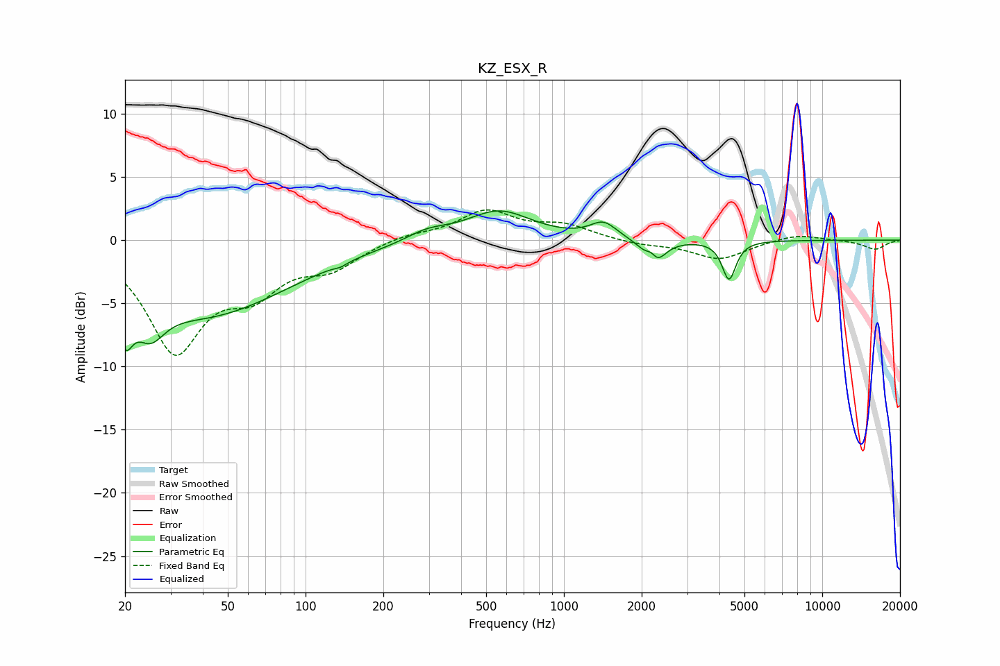

# KZ_ESX_R
See [usage instructions](https://github.com/jaakkopasanen/AutoEq#usage) for more options and info.

### Parametric EQs
Apply preamp of -2.4 dB when using parametric equalizer.

|   # | Type    |   Fc (Hz) |    Q |   Gain (dB) |
|-----|---------|-----------|------|-------------|
|   1 | Peaking |        20 | 4.87 |        -3.5 |
|   2 | Peaking |        25 | 2.54 |        -2.8 |
|   3 | Peaking |        41 | 0.44 |        -5.8 |
|   4 | Peaking |       137 | 5.97 |        -0.2 |
|   5 | Peaking |       294 | 1.67 |         0.8 |
|   6 | Peaking |       560 | 1.12 |         2.3 |
|   7 | Peaking |      1423 | 2.77 |         1.3 |
|   8 | Peaking |      2187 | 5.86 |         2.2 |
|   9 | Peaking |      2213 | 4.05 |        -3.5 |
|  10 | Peaking |      4357 | 5.44 |        -3.1 |

### Fixed Band EQs
When using fixed band (also called graphic) equalizer, apply preamp of **-2.5 dB** (if available) and set gains manually with these parameters.

|   # | Type    |   Fc (Hz) |    Q |   Gain (dB) |
|-----|---------|-----------|------|-------------|
|   1 | Peaking |        31 | 1.41 |        -8.4 |
|   2 | Peaking |        62 | 1.41 |        -3.3 |
|   3 | Peaking |       125 | 1.41 |        -1.9 |
|   4 | Peaking |       250 | 1.41 |         0.5 |
|   5 | Peaking |       500 | 1.41 |         2.2 |
|   6 | Peaking |      1000 | 1.41 |         1.1 |
|   7 | Peaking |      2000 | 1.41 |        -0.3 |
|   8 | Peaking |      4000 | 1.41 |        -1.5 |
|   9 | Peaking |      8000 | 1.41 |         0.5 |
|  10 | Peaking |     16000 | 1.41 |        -0.7 |

### Graphs

