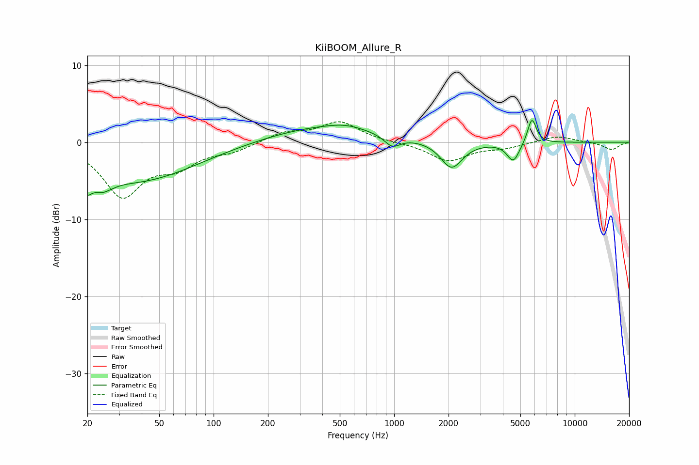

# KiiBOOM_Allure_R
See [usage instructions](https://github.com/jaakkopasanen/AutoEq#usage) for more options and info.

### Parametric EQs
Apply preamp of -2.9 dB when using parametric equalizer.

|   # | Type    |   Fc (Hz) |    Q |   Gain (dB) |
|-----|---------|-----------|------|-------------|
|   1 | Peaking |        20 | 5.54 |        -5.5 |
|   2 | Peaking |        20 | 5.52 |         3.4 |
|   3 | Peaking |        24 | 2.29 |        -2   |
|   4 | Peaking |        38 | 0.44 |        -4.9 |
|   5 | Peaking |       399 | 0.46 |         2   |
|   6 | Peaking |       539 | 1.41 |         0.6 |
|   7 | Peaking |       976 | 3.19 |        -1.5 |
|   8 | Peaking |      2079 | 2.37 |        -3.5 |
|   9 | Peaking |      4570 | 4.04 |        -2.5 |
|  10 | Peaking |      5790 | 5.7  |         3.4 |

### Fixed Band EQs
When using fixed band (also called graphic) equalizer, apply preamp of **-2.8 dB** (if available) and set gains manually with these parameters.

|   # | Type    |   Fc (Hz) |    Q |   Gain (dB) |
|-----|---------|-----------|------|-------------|
|   1 | Peaking |        31 | 1.41 |        -6.8 |
|   2 | Peaking |        62 | 1.41 |        -2.6 |
|   3 | Peaking |       125 | 1.41 |        -1   |
|   4 | Peaking |       250 | 1.41 |         1.2 |
|   5 | Peaking |       500 | 1.41 |         2.6 |
|   6 | Peaking |      1000 | 1.41 |        -0   |
|   7 | Peaking |      2000 | 1.41 |        -2.4 |
|   8 | Peaking |      4000 | 1.41 |        -0.6 |
|   9 | Peaking |      8000 | 1.41 |         0.9 |
|  10 | Peaking |     16000 | 1.41 |        -1   |

### Graphs

