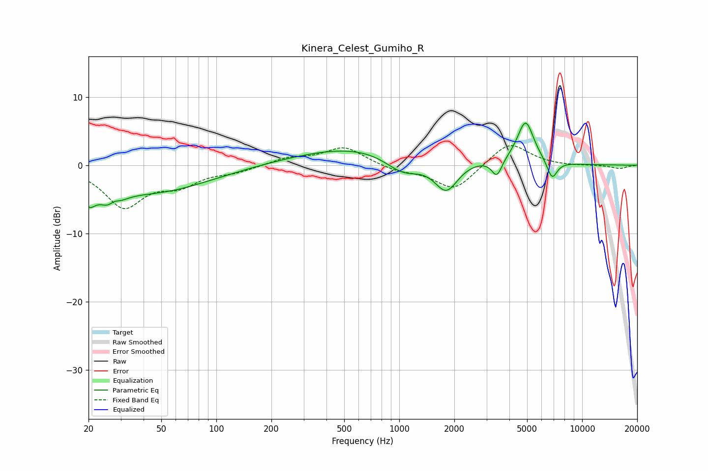

# Kinera_Celest_Gumiho_R
See [usage instructions](https://github.com/jaakkopasanen/AutoEq#usage) for more options and info.

### Parametric EQs
Apply preamp of -6.3 dB when using parametric equalizer.

|   # | Type    |   Fc (Hz) |    Q |   Gain (dB) |
|-----|---------|-----------|------|-------------|
|   1 | Peaking |        20 | 3.75 |        -3   |
|   2 | Peaking |        27 | 2.53 |        -3.5 |
|   3 | Peaking |        27 | 4.54 |         1.5 |
|   4 | Peaking |        45 | 0.47 |        -3.9 |
|   5 | Peaking |       770 | 0.34 |         3.2 |
|   6 | Peaking |      1054 | 1.31 |        -3.3 |
|   7 | Peaking |      1807 | 2.09 |        -4.9 |
|   8 | Peaking |      3417 | 5.09 |        -2.6 |
|   9 | Peaking |      4907 | 3.06 |         6.2 |
|  10 | Peaking |      6851 | 4.84 |        -2.8 |

### Fixed Band EQs
When using fixed band (also called graphic) equalizer, apply preamp of **-3.0 dB** (if available) and set gains manually with these parameters.

|   # | Type    |   Fc (Hz) |    Q |   Gain (dB) |
|-----|---------|-----------|------|-------------|
|   1 | Peaking |        31 | 1.41 |        -5.9 |
|   2 | Peaking |        62 | 1.41 |        -2.5 |
|   3 | Peaking |       125 | 1.41 |        -0.8 |
|   4 | Peaking |       250 | 1.41 |         1   |
|   5 | Peaking |       500 | 1.41 |         2.7 |
|   6 | Peaking |      1000 | 1.41 |        -0.8 |
|   7 | Peaking |      2000 | 1.41 |        -3.7 |
|   8 | Peaking |      4000 | 1.41 |         3.5 |
|   9 | Peaking |      8000 | 1.41 |        -0.1 |
|  10 | Peaking |     16000 | 1.41 |        -0.5 |

### Graphs

