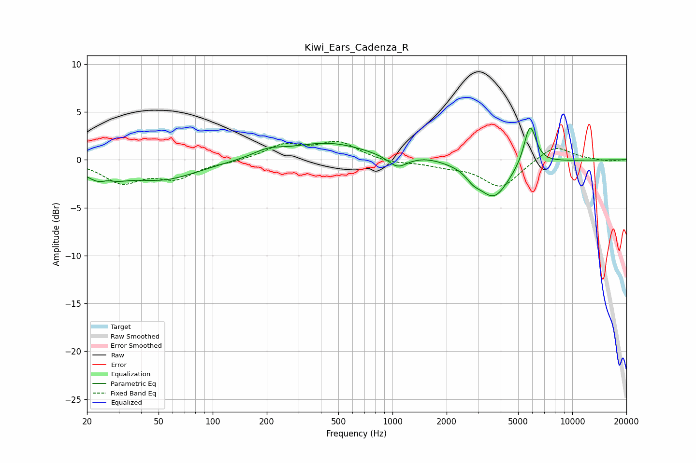

# Kiwi_Ears_Cadenza_R
See [usage instructions](https://github.com/jaakkopasanen/AutoEq#usage) for more options and info.

### Parametric EQs
Apply preamp of -3.4 dB when using parametric equalizer.

|   # | Type    |   Fc (Hz) |    Q |   Gain (dB) |
|-----|---------|-----------|------|-------------|
|   1 | Peaking |        25 | 1.65 |        -2.2 |
|   2 | Peaking |        26 | 3.32 |         0.8 |
|   3 | Peaking |        53 | 0.72 |        -2   |
|   4 | Peaking |       203 | 1.69 |         0.7 |
|   5 | Peaking |       436 | 0.67 |         1.7 |
|   6 | Peaking |      1065 | 2.69 |        -1.2 |
|   7 | Peaking |      1543 | 1.73 |         0.3 |
|   8 | Peaking |      2807 | 3.62 |        -0.8 |
|   9 | Peaking |      3661 | 1.63 |        -3.9 |
|  10 | Peaking |      5821 | 4.1  |         4.3 |

### Fixed Band EQs
When using fixed band (also called graphic) equalizer, apply preamp of **-2.0 dB** (if available) and set gains manually with these parameters.

|   # | Type    |   Fc (Hz) |    Q |   Gain (dB) |
|-----|---------|-----------|------|-------------|
|   1 | Peaking |        31 | 1.41 |        -2.3 |
|   2 | Peaking |        62 | 1.41 |        -1.7 |
|   3 | Peaking |       125 | 1.41 |        -0.2 |
|   4 | Peaking |       250 | 1.41 |         1.5 |
|   5 | Peaking |       500 | 1.41 |         1.8 |
|   6 | Peaking |      1000 | 1.41 |        -0.4 |
|   7 | Peaking |      2000 | 1.41 |        -0.5 |
|   8 | Peaking |      4000 | 1.41 |        -2.9 |
|   9 | Peaking |      8000 | 1.41 |         1.6 |
|  10 | Peaking |     16000 | 1.41 |        -0.2 |

### Graphs

