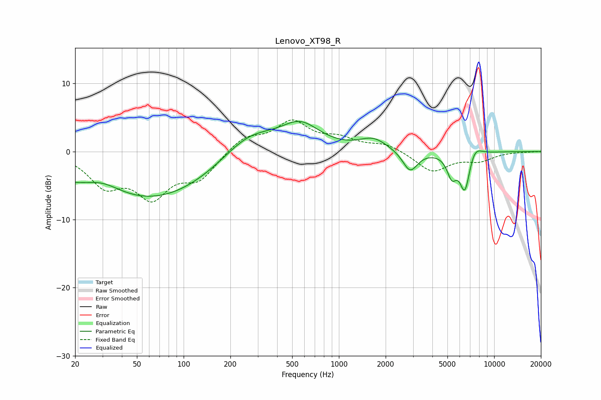

# Lenovo_XT98_R
See [usage instructions](https://github.com/jaakkopasanen/AutoEq#usage) for more options and info.

### Parametric EQs
Apply preamp of -4.5 dB when using parametric equalizer.

|   # | Type    |   Fc (Hz) |    Q |   Gain (dB) |
|-----|---------|-----------|------|-------------|
|   1 | Peaking |        30 | 1.19 |         1.7 |
|   2 | Peaking |        39 | 0.22 |        -5   |
|   3 | Peaking |        69 | 0.44 |        -2.5 |
|   4 | Peaking |       263 | 0.82 |         3.6 |
|   5 | Peaking |       565 | 1.12 |         3.7 |
|   6 | Peaking |      1668 | 1.59 |         1.7 |
|   7 | Peaking |      2875 | 2.97 |        -3.1 |
|   8 | Peaking |      5339 | 4.46 |        -3.1 |
|   9 | Peaking |      6477 | 4.16 |        -5.7 |
|  10 | Peaking |      7479 | 3.2  |         1.7 |

### Fixed Band EQs
When using fixed band (also called graphic) equalizer, apply preamp of **-4.7 dB** (if available) and set gains manually with these parameters.

|   # | Type    |   Fc (Hz) |    Q |   Gain (dB) |
|-----|---------|-----------|------|-------------|
|   1 | Peaking |        31 | 1.41 |        -4.5 |
|   2 | Peaking |        62 | 1.41 |        -6   |
|   3 | Peaking |       125 | 1.41 |        -3.6 |
|   4 | Peaking |       250 | 1.41 |         2.1 |
|   5 | Peaking |       500 | 1.41 |         4.1 |
|   6 | Peaking |      1000 | 1.41 |         1.6 |
|   7 | Peaking |      2000 | 1.41 |         1.1 |
|   8 | Peaking |      4000 | 1.41 |        -2.9 |
|   9 | Peaking |      8000 | 1.41 |        -1.2 |
|  10 | Peaking |     16000 | 1.41 |        -0   |

### Graphs

