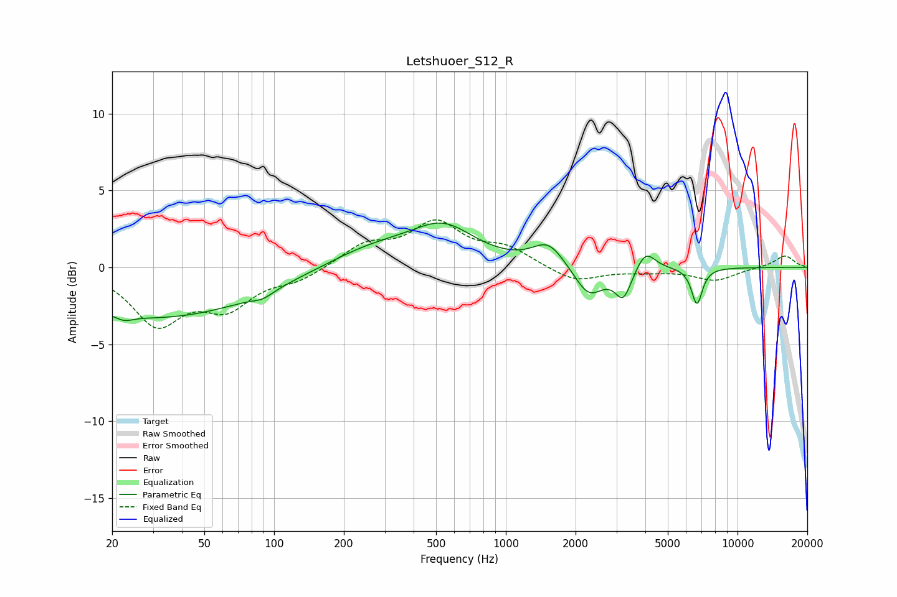

# Letshuoer_S12_R
See [usage instructions](https://github.com/jaakkopasanen/AutoEq#usage) for more options and info.

### Parametric EQs
Apply preamp of -3.0 dB when using parametric equalizer.

|   # | Type    |   Fc (Hz) |    Q |   Gain (dB) |
|-----|---------|-----------|------|-------------|
|   1 | Peaking |        23 | 3.71 |        -0.4 |
|   2 | Peaking |        32 | 0.31 |        -3.3 |
|   3 | Peaking |        89 | 3.08 |        -0.4 |
|   4 | Peaking |       268 | 0.68 |         1.3 |
|   5 | Peaking |       538 | 1.04 |         2.3 |
|   6 | Peaking |      1527 | 2.07 |         1.5 |
|   7 | Peaking |      2282 | 2.22 |        -2   |
|   8 | Peaking |      3215 | 3.99 |        -1.9 |
|   9 | Peaking |      4008 | 3.4  |         1.3 |
|  10 | Peaking |      6679 | 5.89 |        -2.4 |

### Fixed Band EQs
When using fixed band (also called graphic) equalizer, apply preamp of **-3.2 dB** (if available) and set gains manually with these parameters.

|   # | Type    |   Fc (Hz) |    Q |   Gain (dB) |
|-----|---------|-----------|------|-------------|
|   1 | Peaking |        31 | 1.41 |        -3.5 |
|   2 | Peaking |        62 | 1.41 |        -2.3 |
|   3 | Peaking |       125 | 1.41 |        -0.7 |
|   4 | Peaking |       250 | 1.41 |         1.4 |
|   5 | Peaking |       500 | 1.41 |         2.7 |
|   6 | Peaking |      1000 | 1.41 |         1.1 |
|   7 | Peaking |      2000 | 1.41 |        -1   |
|   8 | Peaking |      4000 | 1.41 |        -0.2 |
|   9 | Peaking |      8000 | 1.41 |        -0.8 |
|  10 | Peaking |     16000 | 1.41 |         0.8 |

### Graphs

