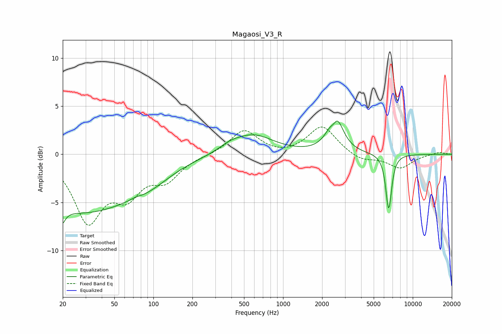

# Magaosi_V3_R
See [usage instructions](https://github.com/jaakkopasanen/AutoEq#usage) for more options and info.

### Parametric EQs
Apply preamp of -3.6 dB when using parametric equalizer.

|   # | Type    |   Fc (Hz) |    Q |   Gain (dB) |
|-----|---------|-----------|------|-------------|
|   1 | Peaking |        20 | 5.58 |        -4.8 |
|   2 | Peaking |        20 | 5.75 |         3.3 |
|   3 | Peaking |        28 | 0.33 |        -5.9 |
|   4 | Peaking |        72 | 3.53 |         0.2 |
|   5 | Peaking |        92 | 0.86 |        -1   |
|   6 | Peaking |       388 | 1.83 |         0.5 |
|   7 | Peaking |       584 | 0.89 |         2   |
|   8 | Peaking |      2458 | 5.13 |        -1.3 |
|   9 | Peaking |      2522 | 2.65 |         4.4 |
|  10 | Peaking |      6526 | 6    |        -5.8 |

### Fixed Band EQs
When using fixed band (also called graphic) equalizer, apply preamp of **-2.9 dB** (if available) and set gains manually with these parameters.

|   # | Type    |   Fc (Hz) |    Q |   Gain (dB) |
|-----|---------|-----------|------|-------------|
|   1 | Peaking |        31 | 1.41 |        -6.6 |
|   2 | Peaking |        62 | 1.41 |        -3.6 |
|   3 | Peaking |       125 | 1.41 |        -2.3 |
|   4 | Peaking |       250 | 1.41 |        -0.1 |
|   5 | Peaking |       500 | 1.41 |         2.5 |
|   6 | Peaking |      1000 | 1.41 |        -0.2 |
|   7 | Peaking |      2000 | 1.41 |         3   |
|   8 | Peaking |      4000 | 1.41 |        -0.7 |
|   9 | Peaking |      8000 | 1.41 |        -1.4 |
|  10 | Peaking |     16000 | 1.41 |         0.2 |

### Graphs

