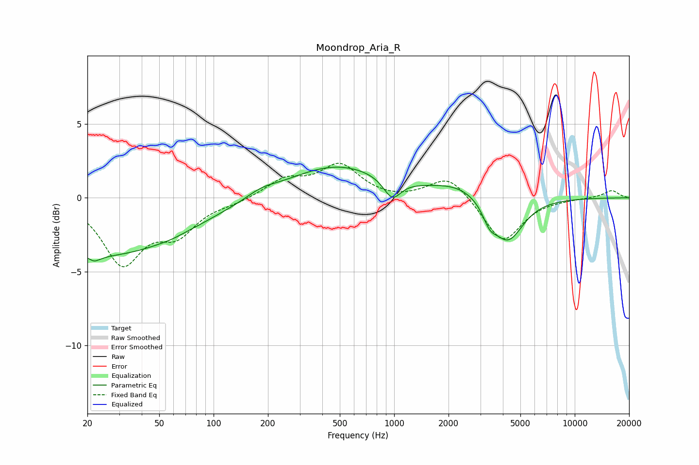

# Moondrop_Aria_R
See [usage instructions](https://github.com/jaakkopasanen/AutoEq#usage) for more options and info.

### Parametric EQs
Apply preamp of -2.2 dB when using parametric equalizer.

|   # | Type    |   Fc (Hz) |    Q |   Gain (dB) |
|-----|---------|-----------|------|-------------|
|   1 | Peaking |        22 | 5.75 |        -3   |
|   2 | Peaking |        22 | 6    |         2.7 |
|   3 | Peaking |        23 | 0.28 |        -3.9 |
|   4 | Peaking |        58 | 2.46 |        -0.1 |
|   5 | Peaking |       184 | 1.72 |         0.4 |
|   6 | Peaking |       481 | 0.52 |         2.2 |
|   7 | Peaking |       975 | 2.95 |        -1.4 |
|   8 | Peaking |      2336 | 0.93 |         0.9 |
|   9 | Peaking |      3377 | 3.75 |        -1   |
|  10 | Peaking |      4250 | 1.64 |        -3.1 |

### Fixed Band EQs
When using fixed band (also called graphic) equalizer, apply preamp of **-2.4 dB** (if available) and set gains manually with these parameters.

|   # | Type    |   Fc (Hz) |    Q |   Gain (dB) |
|-----|---------|-----------|------|-------------|
|   1 | Peaking |        31 | 1.41 |        -4.3 |
|   2 | Peaking |        62 | 1.41 |        -2.1 |
|   3 | Peaking |       125 | 1.41 |        -0.3 |
|   4 | Peaking |       250 | 1.41 |         1.2 |
|   5 | Peaking |       500 | 1.41 |         2.1 |
|   6 | Peaking |      1000 | 1.41 |        -0.2 |
|   7 | Peaking |      2000 | 1.41 |         1.6 |
|   8 | Peaking |      4000 | 1.41 |        -3   |
|   9 | Peaking |      8000 | 1.41 |        -0.1 |
|  10 | Peaking |     16000 | 1.41 |         0.5 |

### Graphs

