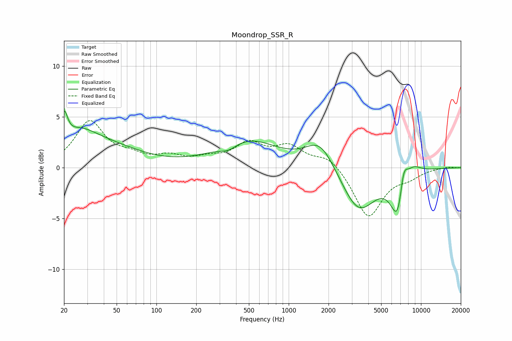

# Moondrop_SSR_R
See [usage instructions](https://github.com/jaakkopasanen/AutoEq#usage) for more options and info.

### Parametric EQs
Apply preamp of -5.7 dB when using parametric equalizer.

|   # | Type    |   Fc (Hz) |    Q |   Gain (dB) |
|-----|---------|-----------|------|-------------|
|   1 | Peaking |        20 | 5.49 |         2.8 |
|   2 | Peaking |        26 | 1.05 |         2.3 |
|   3 | Peaking |        43 | 0.56 |         1.8 |
|   4 | Peaking |       351 | 2.11 |        -0.7 |
|   5 | Peaking |       487 | 0.63 |         2.7 |
|   6 | Peaking |      1729 | 1.28 |         2.8 |
|   7 | Peaking |      3370 | 1.1  |        -4.4 |
|   8 | Peaking |      6782 | 2.49 |        -5.5 |
|   9 | Peaking |      7359 | 4.05 |         3.6 |
|  10 | Peaking |      8618 | 2.06 |         1.2 |

### Fixed Band EQs
When using fixed band (also called graphic) equalizer, apply preamp of **-4.7 dB** (if available) and set gains manually with these parameters.

|   # | Type    |   Fc (Hz) |    Q |   Gain (dB) |
|-----|---------|-----------|------|-------------|
|   1 | Peaking |        31 | 1.41 |         4.4 |
|   2 | Peaking |        62 | 1.41 |         0.9 |
|   3 | Peaking |       125 | 1.41 |         0.9 |
|   4 | Peaking |       250 | 1.41 |         0.7 |
|   5 | Peaking |       500 | 1.41 |         2.2 |
|   6 | Peaking |      1000 | 1.41 |         1.9 |
|   7 | Peaking |      2000 | 1.41 |         1.2 |
|   8 | Peaking |      4000 | 1.41 |        -4.9 |
|   9 | Peaking |      8000 | 1.41 |        -0.8 |
|  10 | Peaking |     16000 | 1.41 |         0.1 |

### Graphs

