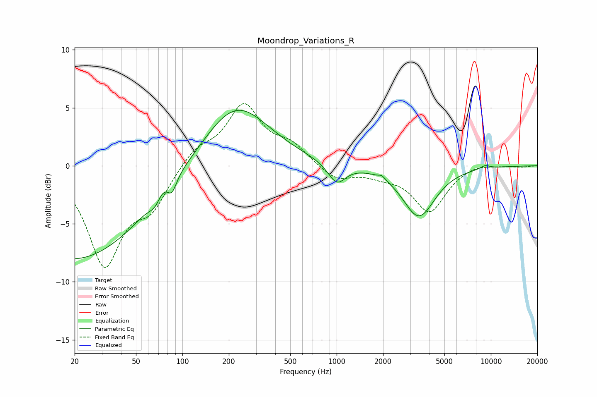

# Moondrop_Variations_R
See [usage instructions](https://github.com/jaakkopasanen/AutoEq#usage) for more options and info.

### Parametric EQs
Apply preamp of -4.9 dB when using parametric equalizer.

|   # | Type    |   Fc (Hz) |    Q |   Gain (dB) |
|-----|---------|-----------|------|-------------|
|   1 | Peaking |        20 | 0.31 |        -8.1 |
|   2 | Peaking |        67 | 3.23 |        -1.7 |
|   3 | Peaking |        71 | 2.31 |         1.8 |
|   4 | Peaking |        85 | 4.7  |        -1.4 |
|   5 | Peaking |       221 | 0.65 |         5.5 |
|   6 | Peaking |      1002 | 2.47 |        -1.8 |
|   7 | Peaking |      1913 | 6    |        -1   |
|   8 | Peaking |      1925 | 5.9  |         1.3 |
|   9 | Peaking |      3410 | 1.36 |        -4.3 |
|  10 | Peaking |      9180 | 3.86 |         0.3 |

### Fixed Band EQs
When using fixed band (also called graphic) equalizer, apply preamp of **-5.5 dB** (if available) and set gains manually with these parameters.

|   # | Type    |   Fc (Hz) |    Q |   Gain (dB) |
|-----|---------|-----------|------|-------------|
|   1 | Peaking |        31 | 1.41 |        -8.3 |
|   2 | Peaking |        62 | 1.41 |        -3   |
|   3 | Peaking |       125 | 1.41 |         1.5 |
|   4 | Peaking |       250 | 1.41 |         5   |
|   5 | Peaking |       500 | 1.41 |         1.6 |
|   6 | Peaking |      1000 | 1.41 |        -1.2 |
|   7 | Peaking |      2000 | 1.41 |        -0.6 |
|   8 | Peaking |      4000 | 1.41 |        -3.9 |
|   9 | Peaking |      8000 | 1.41 |         0.3 |
|  10 | Peaking |     16000 | 1.41 |        -0.1 |

### Graphs

