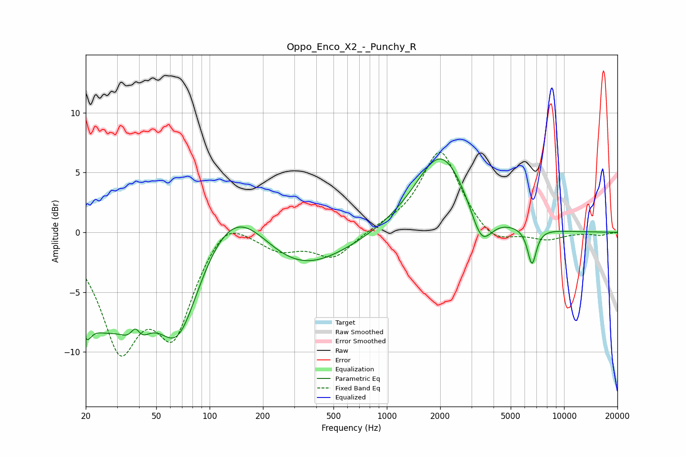

# Oppo_Enco_X2_-_Punchy_R
See [usage instructions](https://github.com/jaakkopasanen/AutoEq#usage) for more options and info.

### Parametric EQs
Apply preamp of -6.2 dB when using parametric equalizer.

|   # | Type    |   Fc (Hz) |    Q |   Gain (dB) |
|-----|---------|-----------|------|-------------|
|   1 | Peaking |        20 | 4.58 |        -2.5 |
|   2 | Peaking |        25 | 0.9  |        -6.3 |
|   3 | Peaking |        38 | 4.1  |         4.2 |
|   4 | Peaking |        38 | 2.73 |        -5.6 |
|   5 | Peaking |        66 | 1.11 |        -8.4 |
|   6 | Peaking |       139 | 0.73 |         4.8 |
|   7 | Peaking |       301 | 0.53 |        -3.8 |
|   8 | Peaking |      2021 | 0.96 |         6.8 |
|   9 | Peaking |      3418 | 2.36 |        -3.2 |
|  10 | Peaking |      6591 | 5.43 |        -3   |

### Fixed Band EQs
When using fixed band (also called graphic) equalizer, apply preamp of **-6.8 dB** (if available) and set gains manually with these parameters.

|   # | Type    |   Fc (Hz) |    Q |   Gain (dB) |
|-----|---------|-----------|------|-------------|
|   1 | Peaking |        31 | 1.41 |        -8.9 |
|   2 | Peaking |        62 | 1.41 |        -7.6 |
|   3 | Peaking |       125 | 1.41 |         1.9 |
|   4 | Peaking |       250 | 1.41 |        -1.3 |
|   5 | Peaking |       500 | 1.41 |        -2.1 |
|   6 | Peaking |      1000 | 1.41 |         0.3 |
|   7 | Peaking |      2000 | 1.41 |         7   |
|   8 | Peaking |      4000 | 1.41 |        -1.3 |
|   9 | Peaking |      8000 | 1.41 |        -0.6 |
|  10 | Peaking |     16000 | 1.41 |        -0.2 |

### Graphs

