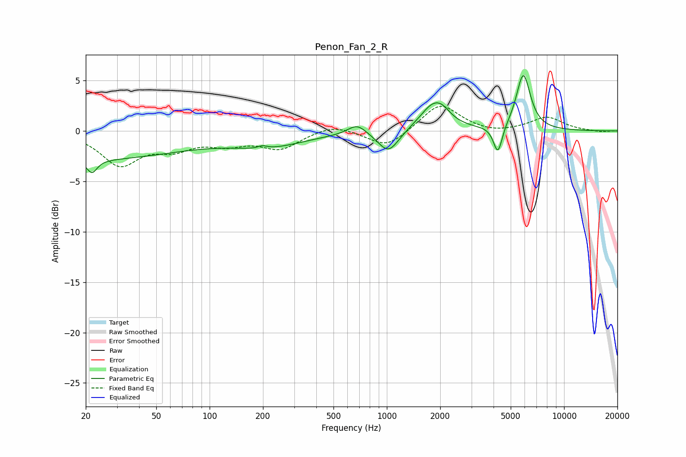

# Penon_Fan_2_R
See [usage instructions](https://github.com/jaakkopasanen/AutoEq#usage) for more options and info.

### Parametric EQs
Apply preamp of -5.6 dB when using parametric equalizer.

|   # | Type    |   Fc (Hz) |    Q |   Gain (dB) |
|-----|---------|-----------|------|-------------|
|   1 | Peaking |        20 | 0.24 |        -2.8 |
|   2 | Peaking |        22 | 5.01 |        -1.3 |
|   3 | Peaking |       199 | 5.97 |         0.3 |
|   4 | Peaking |       215 | 0.67 |        -1.3 |
|   5 | Peaking |       679 | 2.71 |         1   |
|   6 | Peaking |      1021 | 2.39 |        -2.2 |
|   7 | Peaking |      1838 | 1.84 |         2.6 |
|   8 | Peaking |      2061 | 3.29 |         0.5 |
|   9 | Peaking |      4234 | 5.66 |        -2.8 |
|  10 | Peaking |      5891 | 3.49 |         5.6 |

### Fixed Band EQs
When using fixed band (also called graphic) equalizer, apply preamp of **-2.5 dB** (if available) and set gains manually with these parameters.

|   # | Type    |   Fc (Hz) |    Q |   Gain (dB) |
|-----|---------|-----------|------|-------------|
|   1 | Peaking |        31 | 1.41 |        -3.2 |
|   2 | Peaking |        62 | 1.41 |        -1.5 |
|   3 | Peaking |       125 | 1.41 |        -1.1 |
|   4 | Peaking |       250 | 1.41 |        -1.7 |
|   5 | Peaking |       500 | 1.41 |         0.7 |
|   6 | Peaking |      1000 | 1.41 |        -1.7 |
|   7 | Peaking |      2000 | 1.41 |         2.8 |
|   8 | Peaking |      4000 | 1.41 |        -0.3 |
|   9 | Peaking |      8000 | 1.41 |         1.3 |
|  10 | Peaking |     16000 | 1.41 |        -0.1 |

### Graphs

