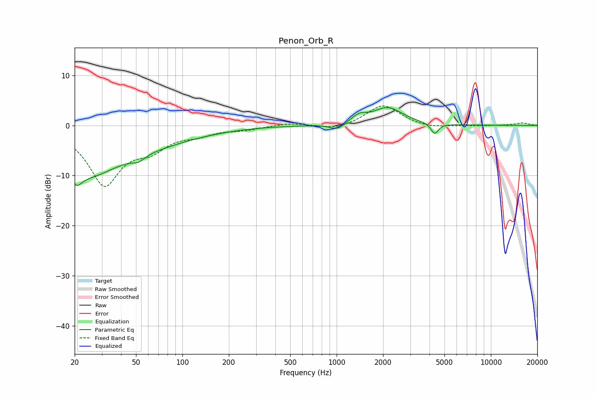

# Penon_Orb_R
See [usage instructions](https://github.com/jaakkopasanen/AutoEq#usage) for more options and info.

### Parametric EQs
Apply preamp of -3.7 dB when using parametric equalizer.

|   # | Type    |   Fc (Hz) |    Q |   Gain (dB) |
|-----|---------|-----------|------|-------------|
|   1 | Peaking |        21 | 5.09 |        -5   |
|   2 | Peaking |        21 | 5.99 |         2.3 |
|   3 | Peaking |        23 | 0.76 |        -6.6 |
|   4 | Peaking |        44 | 0.36 |        -3.9 |
|   5 | Peaking |        52 | 3.67 |        -1   |
|   6 | Peaking |      1013 | 2.9  |        -1.3 |
|   7 | Peaking |      1391 | 2.84 |         1.5 |
|   8 | Peaking |      2146 | 1.46 |         3.5 |
|   9 | Peaking |      4321 | 5.94 |        -2.1 |
|  10 | Peaking |      9920 | 3.22 |         0   |

### Fixed Band EQs
When using fixed band (also called graphic) equalizer, apply preamp of **-4.0 dB** (if available) and set gains manually with these parameters.

|   # | Type    |   Fc (Hz) |    Q |   Gain (dB) |
|-----|---------|-----------|------|-------------|
|   1 | Peaking |        31 | 1.41 |       -11.5 |
|   2 | Peaking |        62 | 1.41 |        -3.5 |
|   3 | Peaking |       125 | 1.41 |        -1.4 |
|   4 | Peaking |       250 | 1.41 |        -0.7 |
|   5 | Peaking |       500 | 1.41 |         0.5 |
|   6 | Peaking |      1000 | 1.41 |        -0.9 |
|   7 | Peaking |      2000 | 1.41 |         4.2 |
|   8 | Peaking |      4000 | 1.41 |        -0.6 |
|   9 | Peaking |      8000 | 1.41 |        -0.1 |
|  10 | Peaking |     16000 | 1.41 |         0.5 |

### Graphs

