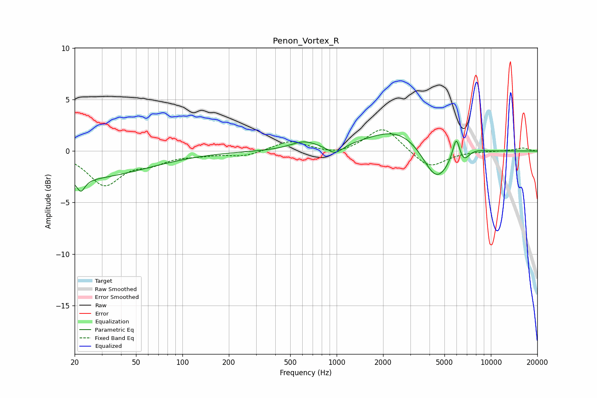

# Penon_Vortex_R
See [usage instructions](https://github.com/jaakkopasanen/AutoEq#usage) for more options and info.

### Parametric EQs
Apply preamp of -1.8 dB when using parametric equalizer.

|   # | Type    |   Fc (Hz) |    Q |   Gain (dB) |
|-----|---------|-----------|------|-------------|
|   1 | Peaking |        20 | 0.31 |        -2.7 |
|   2 | Peaking |        22 | 5.58 |        -1.2 |
|   3 | Peaking |       612 | 1.64 |         0.8 |
|   4 | Peaking |       977 | 2.83 |        -0.9 |
|   5 | Peaking |      2539 | 0.71 |         2.3 |
|   6 | Peaking |      4425 | 1.56 |        -3.7 |
|   7 | Peaking |      5956 | 3.71 |         0.3 |
|   8 | Peaking |      5965 | 6    |         2.1 |
|   9 | Peaking |      6639 | 3.8  |        -1   |
|  10 | Peaking |      7708 | 2.03 |         0.3 |

### Fixed Band EQs
When using fixed band (also called graphic) equalizer, apply preamp of **-2.2 dB** (if available) and set gains manually with these parameters.

|   # | Type    |   Fc (Hz) |    Q |   Gain (dB) |
|-----|---------|-----------|------|-------------|
|   1 | Peaking |        31 | 1.41 |        -3.2 |
|   2 | Peaking |        62 | 1.41 |        -0.9 |
|   3 | Peaking |       125 | 1.41 |        -0.3 |
|   4 | Peaking |       250 | 1.41 |        -0.5 |
|   5 | Peaking |       500 | 1.41 |         1   |
|   6 | Peaking |      1000 | 1.41 |        -0.4 |
|   7 | Peaking |      2000 | 1.41 |         2.4 |
|   8 | Peaking |      4000 | 1.41 |        -1.7 |
|   9 | Peaking |      8000 | 1.41 |         0   |
|  10 | Peaking |     16000 | 1.41 |         0.3 |

### Graphs

