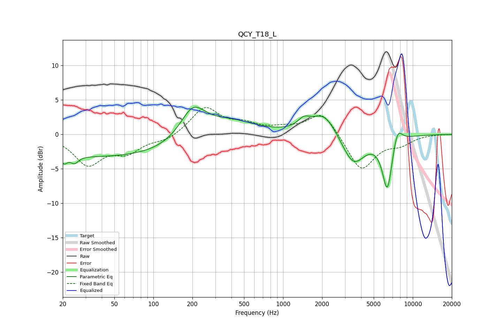

# QCY_T18_L
See [usage instructions](https://github.com/jaakkopasanen/AutoEq#usage) for more options and info.

### Parametric EQs
Apply preamp of -4.0 dB when using parametric equalizer.

|   # | Type    |   Fc (Hz) |    Q |   Gain (dB) |
|-----|---------|-----------|------|-------------|
|   1 | Peaking |        20 | 5.76 |        -1.2 |
|   2 | Peaking |        25 | 4.8  |        -1   |
|   3 | Peaking |        47 | 0.18 |        -3.3 |
|   4 | Peaking |       201 | 1.43 |         4.7 |
|   5 | Peaking |       373 | 0.7  |         2.4 |
|   6 | Peaking |      1445 | 3.03 |         1.3 |
|   7 | Peaking |      2072 | 1.45 |         3.3 |
|   8 | Peaking |      3480 | 1.59 |        -4.5 |
|   9 | Peaking |      6369 | 3.49 |        -7.8 |
|  10 | Peaking |      7606 | 3.65 |         2.6 |

### Fixed Band EQs
When using fixed band (also called graphic) equalizer, apply preamp of **-4.0 dB** (if available) and set gains manually with these parameters.

|   # | Type    |   Fc (Hz) |    Q |   Gain (dB) |
|-----|---------|-----------|------|-------------|
|   1 | Peaking |        31 | 1.41 |        -4.2 |
|   2 | Peaking |        62 | 1.41 |        -2.3 |
|   3 | Peaking |       125 | 1.41 |        -0.9 |
|   4 | Peaking |       250 | 1.41 |         3.9 |
|   5 | Peaking |       500 | 1.41 |         1.2 |
|   6 | Peaking |      1000 | 1.41 |         0.7 |
|   7 | Peaking |      2000 | 1.41 |         3.4 |
|   8 | Peaking |      4000 | 1.41 |        -5.3 |
|   9 | Peaking |      8000 | 1.41 |        -1.2 |
|  10 | Peaking |     16000 | 1.41 |         0   |

### Graphs

