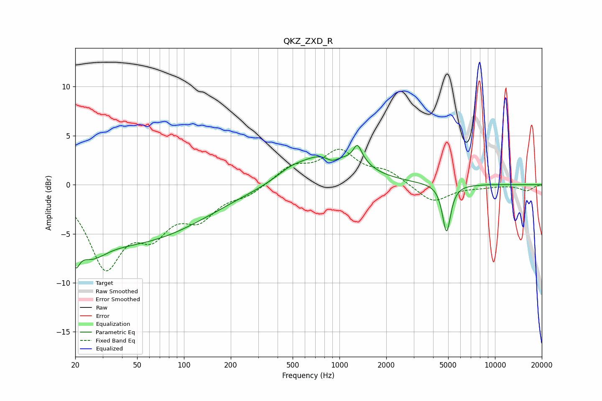

# QKZ_ZXD_R
See [usage instructions](https://github.com/jaakkopasanen/AutoEq#usage) for more options and info.

### Parametric EQs
Apply preamp of -4.1 dB when using parametric equalizer.

|   # | Type    |   Fc (Hz) |    Q |   Gain (dB) |
|-----|---------|-----------|------|-------------|
|   1 | Peaking |        20 | 5.33 |        -2.6 |
|   2 | Peaking |        25 | 1.49 |        -2.4 |
|   3 | Peaking |        46 | 0.3  |        -5.7 |
|   4 | Peaking |       479 | 1.62 |         0.6 |
|   5 | Peaking |       844 | 0.77 |         3.3 |
|   6 | Peaking |       898 | 3.17 |        -0.9 |
|   7 | Peaking |      1302 | 5.67 |         1.5 |
|   8 | Peaking |      1391 | 2.84 |         0.5 |
|   9 | Peaking |      4881 | 5.4  |        -4.9 |
|  10 | Peaking |      9270 | 5.22 |         0   |

### Fixed Band EQs
When using fixed band (also called graphic) equalizer, apply preamp of **-3.7 dB** (if available) and set gains manually with these parameters.

|   # | Type    |   Fc (Hz) |    Q |   Gain (dB) |
|-----|---------|-----------|------|-------------|
|   1 | Peaking |        31 | 1.41 |        -7.9 |
|   2 | Peaking |        62 | 1.41 |        -4   |
|   3 | Peaking |       125 | 1.41 |        -2.9 |
|   4 | Peaking |       250 | 1.41 |        -0.9 |
|   5 | Peaking |       500 | 1.41 |         1.7 |
|   6 | Peaking |      1000 | 1.41 |         3.2 |
|   7 | Peaking |      2000 | 1.41 |         1.2 |
|   8 | Peaking |      4000 | 1.41 |        -1.9 |
|   9 | Peaking |      8000 | 1.41 |        -0.2 |
|  10 | Peaking |     16000 | 1.41 |        -0.6 |

### Graphs

