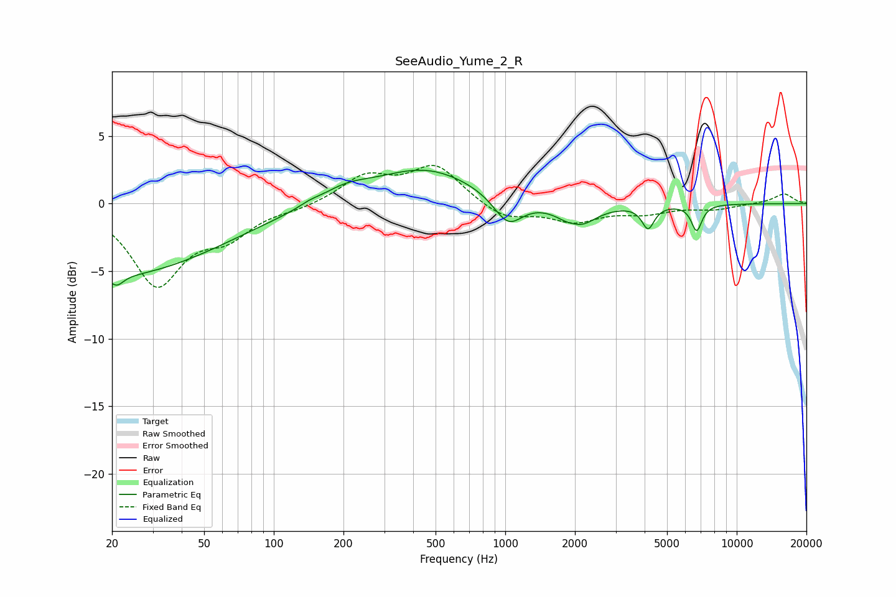

# SeeAudio_Yume_2_R
See [usage instructions](https://github.com/jaakkopasanen/AutoEq#usage) for more options and info.

### Parametric EQs
Apply preamp of -2.6 dB when using parametric equalizer.

|   # | Type    |   Fc (Hz) |    Q |   Gain (dB) |
|-----|---------|-----------|------|-------------|
|   1 | Peaking |        20 | 0.3  |        -5.3 |
|   2 | Peaking |        21 | 5.05 |        -0.8 |
|   3 | Peaking |       142 | 3.28 |         0.2 |
|   4 | Peaking |       203 | 1.33 |         0.9 |
|   5 | Peaking |       451 | 0.65 |         2.6 |
|   6 | Peaking |      1029 | 2.26 |        -2.1 |
|   7 | Peaking |      1997 | 5.41 |         0.2 |
|   8 | Peaking |      2042 | 1.88 |        -1.8 |
|   9 | Peaking |      4140 | 5.4  |        -1.7 |
|  10 | Peaking |      6712 | 6    |        -1.9 |

### Fixed Band EQs
When using fixed band (also called graphic) equalizer, apply preamp of **-2.9 dB** (if available) and set gains manually with these parameters.

|   # | Type    |   Fc (Hz) |    Q |   Gain (dB) |
|-----|---------|-----------|------|-------------|
|   1 | Peaking |        31 | 1.41 |        -5.8 |
|   2 | Peaking |        62 | 1.41 |        -2   |
|   3 | Peaking |       125 | 1.41 |        -0.3 |
|   4 | Peaking |       250 | 1.41 |         1.9 |
|   5 | Peaking |       500 | 1.41 |         2.7 |
|   6 | Peaking |      1000 | 1.41 |        -1.2 |
|   7 | Peaking |      2000 | 1.41 |        -1.2 |
|   8 | Peaking |      4000 | 1.41 |        -0.6 |
|   9 | Peaking |      8000 | 1.41 |        -0.4 |
|  10 | Peaking |     16000 | 1.41 |         0.7 |

### Graphs

