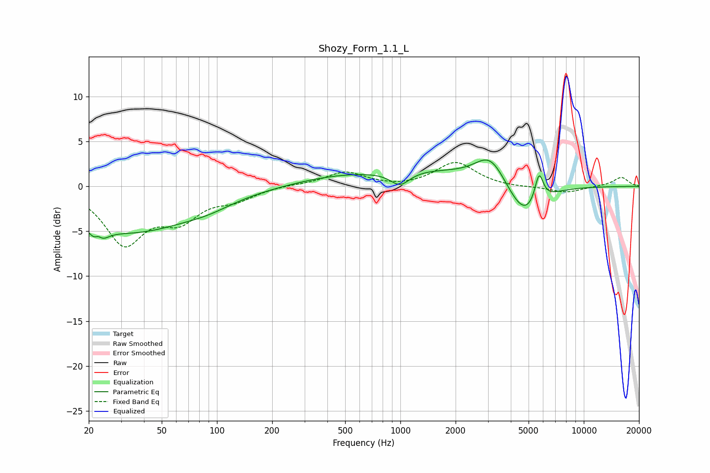

# Shozy_Form_1.1_L
See [usage instructions](https://github.com/jaakkopasanen/AutoEq#usage) for more options and info.

### Parametric EQs
Apply preamp of -3.0 dB when using parametric equalizer.

|   # | Type    |   Fc (Hz) |    Q |   Gain (dB) |
|-----|---------|-----------|------|-------------|
|   1 | Peaking |        22 | 4.34 |        -4.5 |
|   2 | Peaking |        23 | 5.68 |         3.3 |
|   3 | Peaking |        34 | 0.41 |        -5   |
|   4 | Peaking |        90 | 1.07 |        -0.7 |
|   5 | Peaking |       452 | 0.57 |         1   |
|   6 | Peaking |       996 | 2.64 |        -1.6 |
|   7 | Peaking |      1458 | 0.51 |         1.5 |
|   8 | Peaking |      3097 | 1.69 |         3.2 |
|   9 | Peaking |      4754 | 1.5  |        -4   |
|  10 | Peaking |      5703 | 5.88 |         3.3 |

### Fixed Band EQs
When using fixed band (also called graphic) equalizer, apply preamp of **-2.8 dB** (if available) and set gains manually with these parameters.

|   # | Type    |   Fc (Hz) |    Q |   Gain (dB) |
|-----|---------|-----------|------|-------------|
|   1 | Peaking |        31 | 1.41 |        -6.1 |
|   2 | Peaking |        62 | 1.41 |        -3.2 |
|   3 | Peaking |       125 | 1.41 |        -1.2 |
|   4 | Peaking |       250 | 1.41 |         0.2 |
|   5 | Peaking |       500 | 1.41 |         1.6 |
|   6 | Peaking |      1000 | 1.41 |        -0.2 |
|   7 | Peaking |      2000 | 1.41 |         2.7 |
|   8 | Peaking |      4000 | 1.41 |        -0.1 |
|   9 | Peaking |      8000 | 1.41 |        -0.7 |
|  10 | Peaking |     16000 | 1.41 |         1   |

### Graphs

