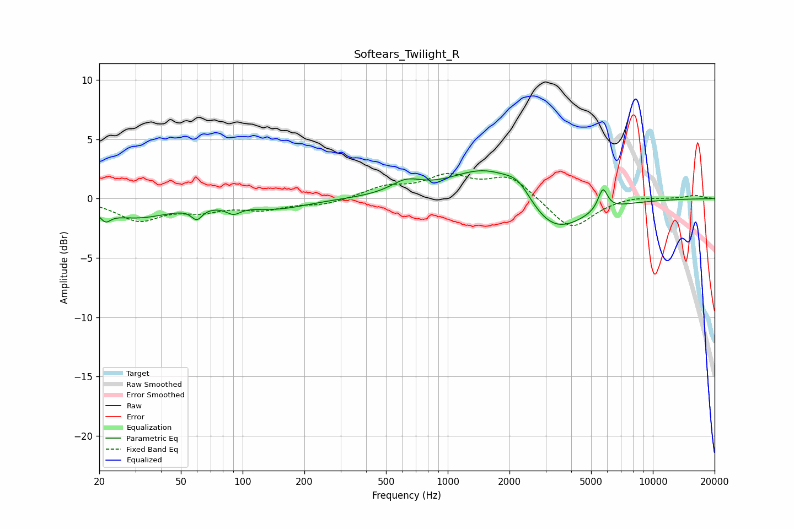

# Softears_Twilight_R
See [usage instructions](https://github.com/jaakkopasanen/AutoEq#usage) for more options and info.

### Parametric EQs
Apply preamp of -2.4 dB when using parametric equalizer.

|   # | Type    |   Fc (Hz) |    Q |   Gain (dB) |
|-----|---------|-----------|------|-------------|
|   1 | Peaking |        21 | 5.77 |        -0.8 |
|   2 | Peaking |        30 | 0.8  |        -1.5 |
|   3 | Peaking |        60 | 5.53 |        -0.9 |
|   4 | Peaking |        90 | 4.22 |        -0.6 |
|   5 | Peaking |       147 | 0.94 |        -0.8 |
|   6 | Peaking |       627 | 1.86 |         1.1 |
|   7 | Peaking |      1564 | 0.81 |         2.9 |
|   8 | Peaking |      2215 | 2.16 |         1.5 |
|   9 | Peaking |      3227 | 0.91 |        -3.5 |
|  10 | Peaking |      5705 | 6    |         1.8 |

### Fixed Band EQs
When using fixed band (also called graphic) equalizer, apply preamp of **-2.2 dB** (if available) and set gains manually with these parameters.

|   # | Type    |   Fc (Hz) |    Q |   Gain (dB) |
|-----|---------|-----------|------|-------------|
|   1 | Peaking |        31 | 1.41 |        -1.8 |
|   2 | Peaking |        62 | 1.41 |        -0.8 |
|   3 | Peaking |       125 | 1.41 |        -0.8 |
|   4 | Peaking |       250 | 1.41 |        -0.5 |
|   5 | Peaking |       500 | 1.41 |         0.9 |
|   6 | Peaking |      1000 | 1.41 |         1.7 |
|   7 | Peaking |      2000 | 1.41 |         1.9 |
|   8 | Peaking |      4000 | 1.41 |        -2.7 |
|   9 | Peaking |      8000 | 1.41 |         0.2 |
|  10 | Peaking |     16000 | 1.41 |         0.3 |

### Graphs

