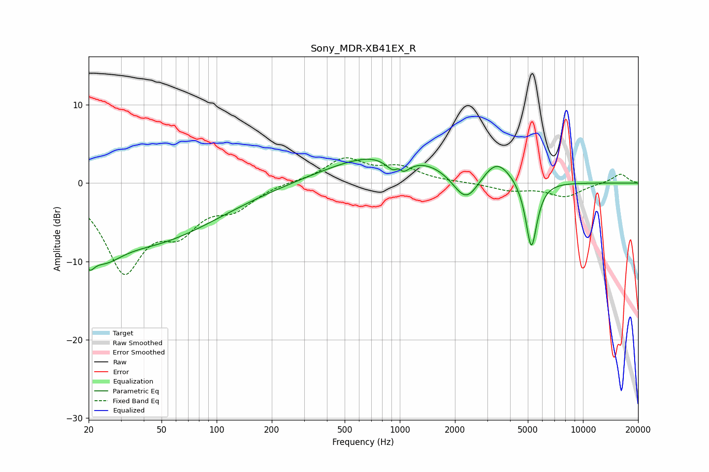

# Sony_MDR-XB41EX_R
See [usage instructions](https://github.com/jaakkopasanen/AutoEq#usage) for more options and info.

### Parametric EQs
Apply preamp of -3.2 dB when using parametric equalizer.

|   # | Type    |   Fc (Hz) |    Q |   Gain (dB) |
|-----|---------|-----------|------|-------------|
|   1 | Peaking |        20 | 4.82 |        -3   |
|   2 | Peaking |        24 | 1.41 |        -4   |
|   3 | Peaking |        44 | 0.38 |        -7.1 |
|   4 | Peaking |       901 | 0.46 |         4.2 |
|   5 | Peaking |       986 | 5.78 |         3   |
|   6 | Peaking |      1000 | 3.29 |        -6.9 |
|   7 | Peaking |      1036 | 3.29 |         2.1 |
|   8 | Peaking |      2301 | 1.9  |        -4.2 |
|   9 | Peaking |      3381 | 1.81 |         2.8 |
|  10 | Peaking |      5228 | 4.44 |        -8.9 |

### Fixed Band EQs
When using fixed band (also called graphic) equalizer, apply preamp of **-3.3 dB** (if available) and set gains manually with these parameters.

|   # | Type    |   Fc (Hz) |    Q |   Gain (dB) |
|-----|---------|-----------|------|-------------|
|   1 | Peaking |        31 | 1.41 |       -10.7 |
|   2 | Peaking |        62 | 1.41 |        -4.7 |
|   3 | Peaking |       125 | 1.41 |        -2.7 |
|   4 | Peaking |       250 | 1.41 |         0.2 |
|   5 | Peaking |       500 | 1.41 |         3   |
|   6 | Peaking |      1000 | 1.41 |         1.8 |
|   7 | Peaking |      2000 | 1.41 |         0.1 |
|   8 | Peaking |      4000 | 1.41 |        -0.9 |
|   9 | Peaking |      8000 | 1.41 |        -1.7 |
|  10 | Peaking |     16000 | 1.41 |         1.2 |

### Graphs

