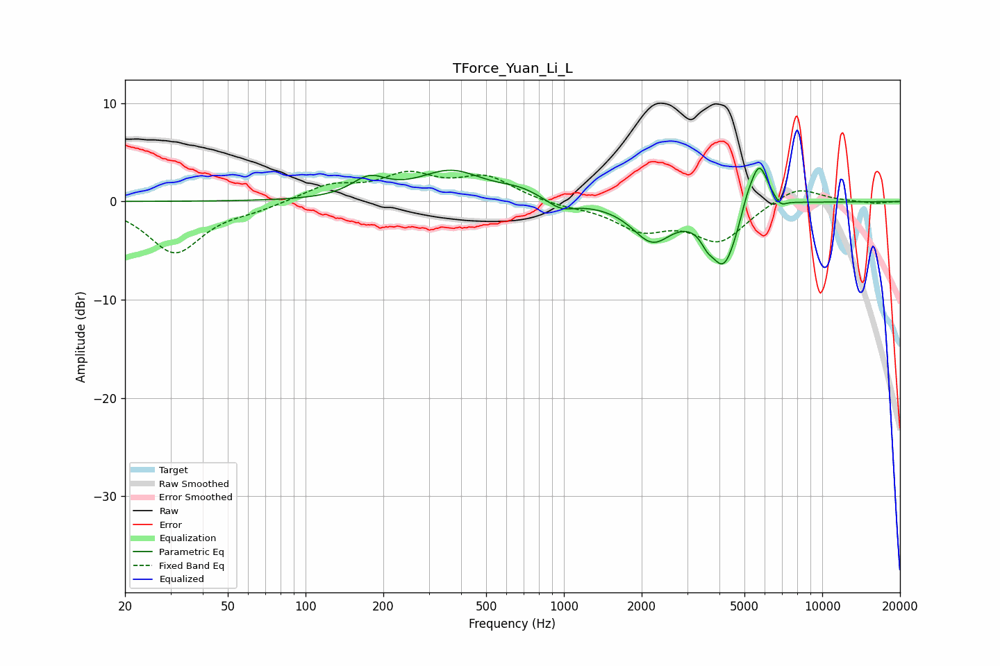

# TForce_Yuan_Li_L
See [usage instructions](https://github.com/jaakkopasanen/AutoEq#usage) for more options and info.

### Parametric EQs
Apply preamp of -3.5 dB when using parametric equalizer.

|   # | Type    |   Fc (Hz) |    Q |   Gain (dB) |
|-----|---------|-----------|------|-------------|
|   1 | Peaking |       176 | 2.11 |         1.9 |
|   2 | Peaking |       366 | 1.11 |         3   |
|   3 | Peaking |       676 | 1.69 |         0.8 |
|   4 | Peaking |       973 | 2.59 |        -1   |
|   5 | Peaking |      2196 | 1.84 |        -3.8 |
|   6 | Peaking |      3580 | 5.99 |        -0.9 |
|   7 | Peaking |      4165 | 2.56 |        -6.4 |
|   8 | Peaking |      5106 | 6    |         1   |
|   9 | Peaking |      5683 | 3.74 |         5   |
|  10 | Peaking |      6898 | 6    |        -0.8 |

### Fixed Band EQs
When using fixed band (also called graphic) equalizer, apply preamp of **-3.2 dB** (if available) and set gains manually with these parameters.

|   # | Type    |   Fc (Hz) |    Q |   Gain (dB) |
|-----|---------|-----------|------|-------------|
|   1 | Peaking |        31 | 1.41 |        -5.2 |
|   2 | Peaking |        62 | 1.41 |        -0.6 |
|   3 | Peaking |       125 | 1.41 |         1.6 |
|   4 | Peaking |       250 | 1.41 |         2.5 |
|   5 | Peaking |       500 | 1.41 |         2.4 |
|   6 | Peaking |      1000 | 1.41 |        -0.4 |
|   7 | Peaking |      2000 | 1.41 |        -2.6 |
|   8 | Peaking |      4000 | 1.41 |        -3.9 |
|   9 | Peaking |      8000 | 1.41 |         1.7 |
|  10 | Peaking |     16000 | 1.41 |        -0.2 |

### Graphs

