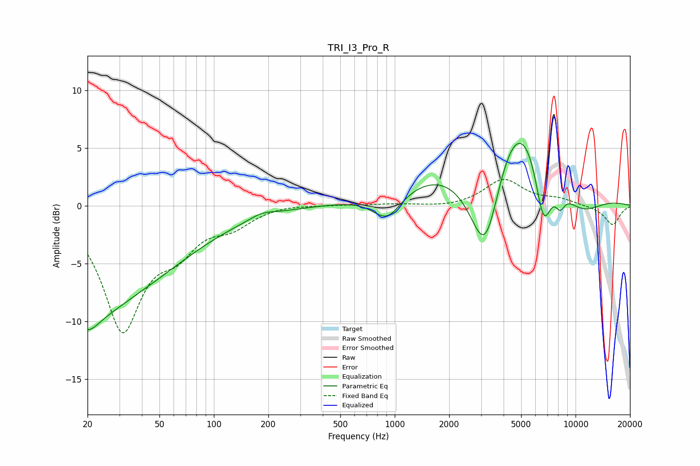

# TRI_I3_Pro_R
See [usage instructions](https://github.com/jaakkopasanen/AutoEq#usage) for more options and info.

### Parametric EQs
Apply preamp of -5.5 dB when using parametric equalizer.

|   # | Type    |   Fc (Hz) |    Q |   Gain (dB) |
|-----|---------|-----------|------|-------------|
|   1 | Peaking |        20 | 1.47 |        -3.5 |
|   2 | Peaking |        23 | 2.24 |         0.6 |
|   3 | Peaking |        24 | 0.33 |        -7.7 |
|   4 | Peaking |       184 | 2.13 |         0.4 |
|   5 | Peaking |       909 | 1.76 |        -2.4 |
|   6 | Peaking |      3174 | 1.21 |       -13.8 |
|   7 | Peaking |      4551 | 0.48 |        14.9 |
|   8 | Peaking |      6639 | 2.74 |        -6.5 |
|   9 | Peaking |      8211 | 4.65 |        -1.5 |
|  10 | Peaking |     10000 | 0.75 |        -5.3 |

### Fixed Band EQs
When using fixed band (also called graphic) equalizer, apply preamp of **-2.4 dB** (if available) and set gains manually with these parameters.

|   # | Type    |   Fc (Hz) |    Q |   Gain (dB) |
|-----|---------|-----------|------|-------------|
|   1 | Peaking |        31 | 1.41 |       -10.4 |
|   2 | Peaking |        62 | 1.41 |        -2.9 |
|   3 | Peaking |       125 | 1.41 |        -1.4 |
|   4 | Peaking |       250 | 1.41 |         0.2 |
|   5 | Peaking |       500 | 1.41 |         0.1 |
|   6 | Peaking |      1000 | 1.41 |         0.1 |
|   7 | Peaking |      2000 | 1.41 |        -0.2 |
|   8 | Peaking |      4000 | 1.41 |         2.3 |
|   9 | Peaking |      8000 | 1.41 |         0.5 |
|  10 | Peaking |     16000 | 1.41 |        -1.7 |

### Graphs

