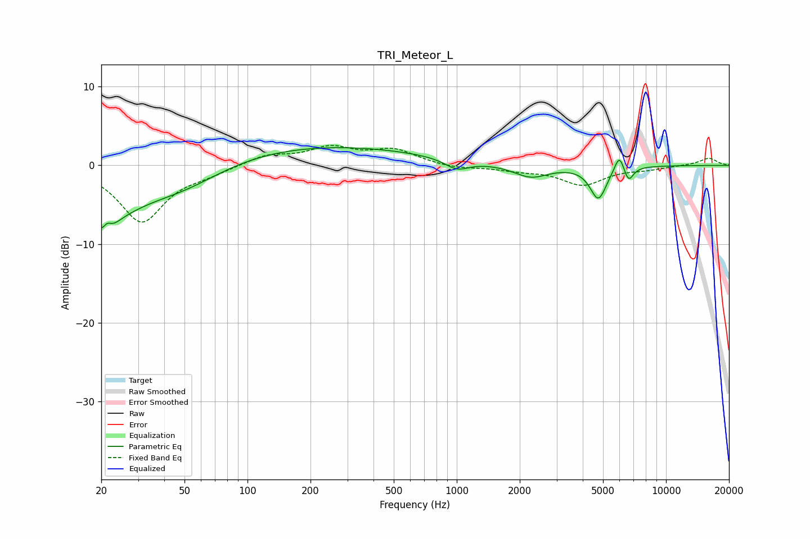

# TRI_Meteor_L
See [usage instructions](https://github.com/jaakkopasanen/AutoEq#usage) for more options and info.

### Parametric EQs
Apply preamp of -2.3 dB when using parametric equalizer.

|   # | Type    |   Fc (Hz) |    Q |   Gain (dB) |
|-----|---------|-----------|------|-------------|
|   1 | Peaking |        21 | 3.45 |        -5.8 |
|   2 | Peaking |        21 | 5.55 |         3.4 |
|   3 | Peaking |        23 | 0.8  |        -4.6 |
|   4 | Peaking |        49 | 0.7  |        -2.7 |
|   5 | Peaking |       208 | 0.27 |         2.6 |
|   6 | Peaking |      1002 | 2.47 |        -1.3 |
|   7 | Peaking |      2263 | 1.7  |        -1.6 |
|   8 | Peaking |      4749 | 3.57 |        -4.2 |
|   9 | Peaking |      5987 | 5.95 |         2.3 |
|  10 | Peaking |      6616 | 6    |        -1.9 |

### Fixed Band EQs
When using fixed band (also called graphic) equalizer, apply preamp of **-2.6 dB** (if available) and set gains manually with these parameters.

|   # | Type    |   Fc (Hz) |    Q |   Gain (dB) |
|-----|---------|-----------|------|-------------|
|   1 | Peaking |        31 | 1.41 |        -7.1 |
|   2 | Peaking |        62 | 1.41 |        -0.8 |
|   3 | Peaking |       125 | 1.41 |         1.3 |
|   4 | Peaking |       250 | 1.41 |         2.1 |
|   5 | Peaking |       500 | 1.41 |         1.8 |
|   6 | Peaking |      1000 | 1.41 |        -0.4 |
|   7 | Peaking |      2000 | 1.41 |        -0.5 |
|   8 | Peaking |      4000 | 1.41 |        -2.4 |
|   9 | Peaking |      8000 | 1.41 |        -0.4 |
|  10 | Peaking |     16000 | 1.41 |         0.9 |

### Graphs

