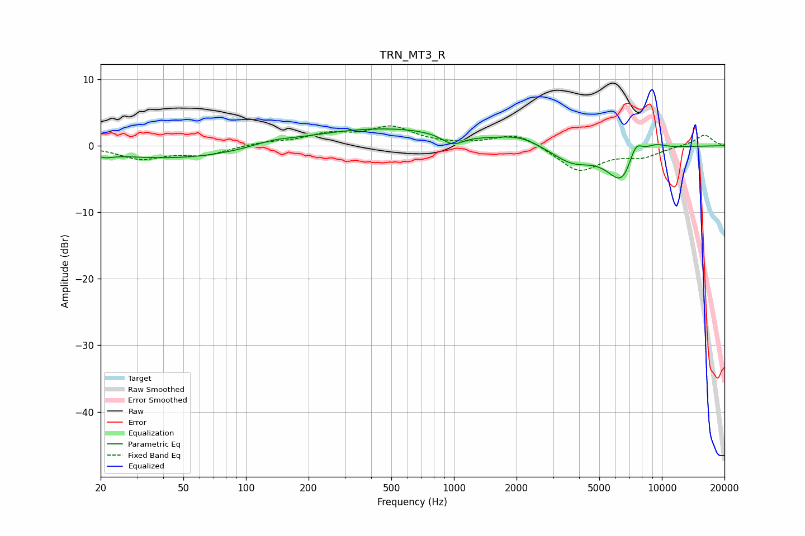

# TRN_MT3_R
See [usage instructions](https://github.com/jaakkopasanen/AutoEq#usage) for more options and info.

### Parametric EQs
Apply preamp of -2.6 dB when using parametric equalizer.

|   # | Type    |   Fc (Hz) |    Q |   Gain (dB) |
|-----|---------|-----------|------|-------------|
|   1 | Peaking |        21 | 3.81 |        -0.5 |
|   2 | Peaking |        46 | 0.41 |        -2   |
|   3 | Peaking |       134 | 1.42 |         0.7 |
|   4 | Peaking |       461 | 0.38 |         2.7 |
|   5 | Peaking |       985 | 2.71 |        -1.6 |
|   6 | Peaking |      2076 | 1.4  |         1.2 |
|   7 | Peaking |      3698 | 1.39 |        -2.5 |
|   8 | Peaking |      6485 | 1.89 |        -5.7 |
|   9 | Peaking |      7463 | 3.73 |         3.5 |
|  10 | Peaking |      9230 | 2.28 |         1.1 |

### Fixed Band EQs
When using fixed band (also called graphic) equalizer, apply preamp of **-3.1 dB** (if available) and set gains manually with these parameters.

|   # | Type    |   Fc (Hz) |    Q |   Gain (dB) |
|-----|---------|-----------|------|-------------|
|   1 | Peaking |        31 | 1.41 |        -1.9 |
|   2 | Peaking |        62 | 1.41 |        -1.3 |
|   3 | Peaking |       125 | 1.41 |         0.5 |
|   4 | Peaking |       250 | 1.41 |         1.6 |
|   5 | Peaking |       500 | 1.41 |         2.6 |
|   6 | Peaking |      1000 | 1.41 |        -0   |
|   7 | Peaking |      2000 | 1.41 |         2   |
|   8 | Peaking |      4000 | 1.41 |        -3.9 |
|   9 | Peaking |      8000 | 1.41 |        -1.5 |
|  10 | Peaking |     16000 | 1.41 |         1.7 |

### Graphs

